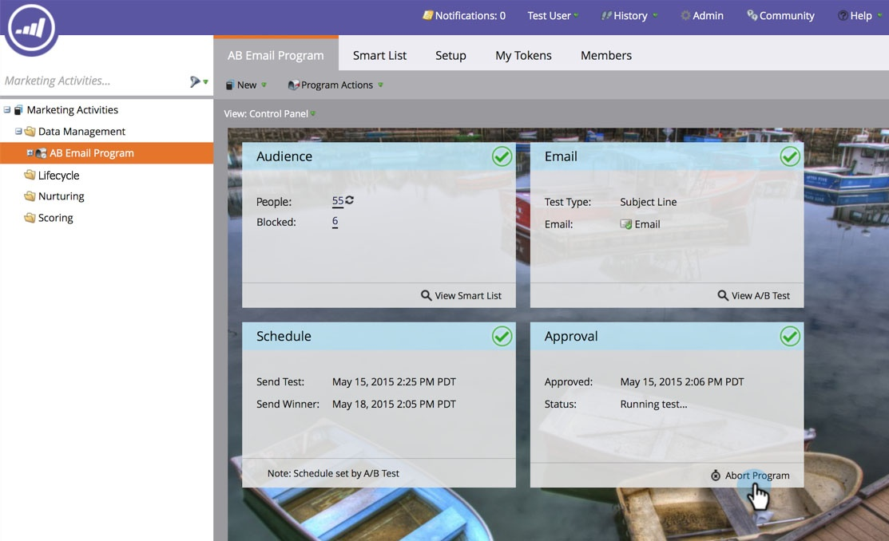

# Anular Programa de Correio Eletrônico {#abort-email-program}

Oops! Aperte os freios! Este programa de email não deve sair.

>[!NOTE]
>
>Este artigo destina-se a ajudá-lo a impedir que emails sejam enviados antes de serem enviados. Não há como recuperar e-mails enviados.

1. Em um programa de email, clique em **Abortar Programa.**

   

1. Clique em **Abortar **para obter confirmação completa.

   

1. Um cabeçalho de alerta será exibido informando que esse programa de email foi abortado.

   

   >[!CAUTION]
   >
   >Depois que o programa de email é abortado, ele não pode ser reagendado.

Uuu! Você não está contente por evitar esses erros caros?
