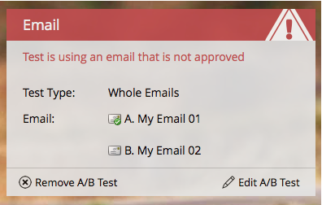

# Aprovar/cancelar aprovação de um programa de email {#approve-unapprove-an-email-program}

>[!PREREQUISITES]
>
>* [Criar um programa de email](/help/marketo/product-docs/email-marketing/email-programs/creating-an-email-program/create-an-email-program.md)
>* [Definir um Público-alvo com uma Smart List](/help/marketo/product-docs/email-marketing/email-programs/managing-people-in-email-programs/define-an-audience-with-a-smart-list.md) ou [Definir um Público-alvo importando uma Lista](/help/marketo/product-docs/email-marketing/email-programs/managing-people-in-email-programs/define-an-audience-by-importing-a-list.md)
>
>* [Escolha um Email](/help/marketo/product-docs/email-marketing/email-programs/email-program-actions/choose-an-existing-email.md) Existente ou [Crie um Email para um Programa de Email](/help/marketo/product-docs/email-marketing/email-programs/email-program-actions/create-an-email-for-an-email-program.md)
>
>* [Agendar Seu Programa De Email](/help/marketo/product-docs/email-marketing/email-programs/email-program-actions/schedule-your-email-program.md)

## Aprovar seu programa de email {#approve-your-email-program}

Agora que seu programa está pronto para ser concluído, o passo final é aprová-lo. Veja como:

1. Vá para **[!UICONTROL Atividades de marketing]**.

   

   Selecione seu programa de email.
   

   >[!CAUTION]
   >
   >Se você não aprovar seu programa de email, o email não será enviado.

1. No bloco **[!UICONTROL Aprovação]**, vá em frente e clique em **[!UICONTROL Aprovar programa]**.

   

1. Se encontrarmos problemas, informaremos você: corrija-os e tente aprovar novamente.

   

   Perfeito! Você está pronto. Seu email será enviado no horário agendado.

   

## Cancelar aprovação do programa de email {#unapprove-your-email-program}

Se você mudar de ideia e decidir que não quer que ele seja lançado, poderá cancelar a aprovação do programa de email.

1. Vá para **[!UICONTROL Atividades de marketing]**.

   

1. Selecione seu programa de email.

   

1. No bloco **[!UICONTROL Aprovação]**, clique em **[!UICONTROL Cancelar aprovação do programa]**.

   

Concluído e concluído! Seu email não será enviado até que você o aprove novamente.
