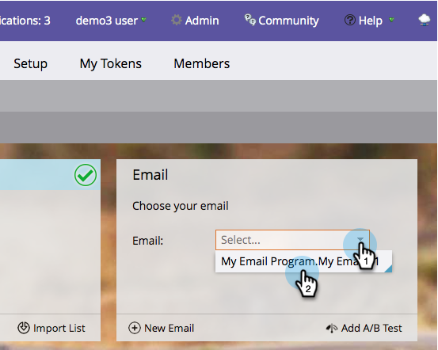

# Escolha um email existente {#choose-an-existing-email}

>[!PREREQUISITES]
>
>* [Criar um Programa por email](../../../../product-docs/email-marketing/email-programs/creating-an-email-program/create-an-email-program.md)
>* [Definir uma Audiência com uma ](../../../../product-docs/email-marketing/email-programs/managing-people-in-email-programs/define-an-audience-with-a-smart-list.md) lista inteligente  [Definir uma Audiência importando uma Lista](../../../../product-docs/email-marketing/email-programs/managing-people-in-email-programs/define-an-audience-by-importing-a-list.md)

>

Depois que você [criar um programa de e-mail](../../../../product-docs/email-marketing/email-programs/creating-an-email-program/create-an-email-program.md) e definir sua audiência, será necessário decidir que e-mail está enviando. Você pode [criar um email para um programa de email](create-an-email-for-an-email-program.md) do zero ou selecionar um que já existe. Aqui está como escolher um que já existe.

1. Vá para **Atividades de marketing**.

   

1. Localize e selecione seu programa de email.

   

1. No bloco **Email**, selecione o que deseja enviar.

   &#39; 

   `

   >[!NOTE]
   >
   >Somente emails locais podem ser selecionados. Precisa mover um email de um programa para outro? [Saiba como aqui](move-an-email.md).

   Doce!   

Agora que decidimos que e-mail enviar, podemos configurar um teste A/B, ou ignorar isso e agendar o programa de e-mail.

>[!NOTE]
>
>**Artigos relacionados**
>
>* [Adicionar um teste A/B](email-test-a-b-test/add-an-a-b-test.md)
>* [Agendar seu Programa de email](schedule-your-email-program.md)

>

