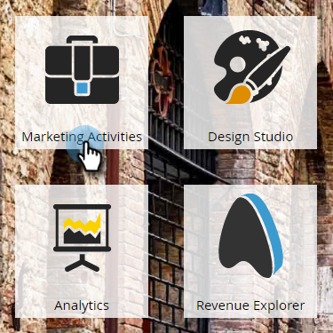

# Criar um email para um programa de email {#create-an-email-for-an-email-program}

>[!PREREQUISITES]
>
>* [Criar um programa de email](/help/marketo/product-docs/email-marketing/email-programs/creating-an-email-program/create-an-email-program.md)
>* [Definir um Público-alvo com uma Smart List](/help/marketo/product-docs/email-marketing/email-programs/managing-people-in-email-programs/define-an-audience-with-a-smart-list.md) ou [Definir um Público-alvo importando uma Lista](/help/marketo/product-docs/email-marketing/email-programs/managing-people-in-email-programs/define-an-audience-by-importing-a-list.md)

Depois de criar seu programa de email e definir seu público-alvo, decida qual email você está enviando. Você pode [escolher um email](/help/marketo/product-docs/email-marketing/email-programs/email-program-actions/choose-an-existing-email.md) existente ou criar um do zero. Veja como criar um novo email.

1. Vá para **[!UICONTROL Atividades de marketing]**.

   

1. Selecione seu programa de email. No bloco **[!UICONTROL Email]**, clique em **[!UICONTROL Novo Email]**.

   

1. Insira um **[!UICONTROL Nome]**, selecione o modelo de sua escolha e clique em **[!UICONTROL Criar]**.

   

1. Faça todas as alterações desejadas e feche o editor.

   

   >[!NOTE]
   >
   >Saiba como [editar elementos em um email](/help/marketo/product-docs/email-marketing/general/email-editor-2/edit-elements-in-an-email.md).

1. Não se esqueça de aprovar seu e-mail.

   

Ótimo! Agora que criamos um email que queremos enviar, vamos [adicionar um teste A/B](/help/marketo/product-docs/email-marketing/email-programs/email-program-actions/email-test-a-b-test/add-an-a-b-test.md) ou pular diretamente para [agendando seu programa de email](/help/marketo/product-docs/email-marketing/email-programs/email-program-actions/schedule-your-email-program.md).
