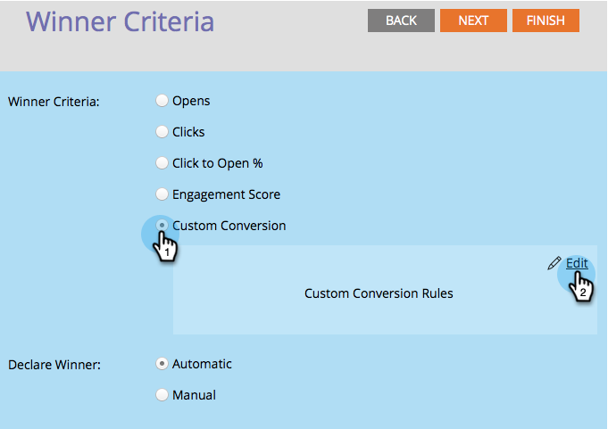

# Definir os critérios do vencedor do teste A/B {#define-the-a-b-test-winner-criteria}

Ao [adicionar um teste A/B](/help/marketo/product-docs/email-marketing/email-programs/email-program-actions/email-test-a-b-test/add-an-a-b-test.md){target="_blank"} ao seu programa de email, você precisará escolher um tipo de teste, [agendar o teste A/B](/help/marketo/product-docs/email-marketing/email-programs/email-program-actions/email-test-a-b-test/schedule-the-a-b-test.md){target="_blank"} e definir os critérios vencedores. Veja como decidir qual email vence.

>[!PREREQUISITES]
>
>[Adicionar um teste A/B](/help/marketo/product-docs/email-marketing/email-programs/email-program-actions/email-test-a-b-test/add-an-a-b-test.md){target="_blank"}

## Critérios vencedores {#winner-criteria}

1. As opções padrão de **Critério de vencedor** são listadas primeiro.

   

   <table>
   <tr>
   <td><b>Aberturas</b></td>
   <td>Uma página aberta é registrada quando imagens são baixadas em um email. Mesmo que você não inclua uma imagem, por padrão, o Marketo insere um único pixel de rastreamento em todos os emails de HTML.</td>
   </tr>
   <tr>
   <td><b>Cliques</b></td>
   <td>Por padrão, os links nos emails têm rastreamento incorporado, permitindo que você veja quem clicou em qual link, quantos links totais foram clicados etc.</td>
   </tr>
   <tr>
   <td><b>Clique para abrir %</b></td>
   <td>Porcentagem de emails abertos com links clicados no email. Isso mede a relevância e o contexto de um email considerando o número de cliques únicos dividido pelo número de aberturas únicas e multiplicando por 100 para mostrá-lo como uma porcentagem.</td>
   </tr>
   <tr>
   <td><b>Pontuação de envolvimento</b></td>
   <td>A <a href="https://experienceleague.adobe.com/docs/marketo/using/product-docs/email-marketing/drip-nurturing/reports-and-notifications/understanding-the-engagement-score.html?lang=pt-BR" target="_blank">pontuação de engajamento</a> ajuda a determinar a eficácia do conteúdo.</td>
   </tr>
   </table>

   >[!TIP]
   >
   >Se você escolher Pontuação de engajamento, o teste precisará ser executado por pelo menos 24 horas. Saiba mais sobre [como entender a pontuação do engajamento](/help/marketo/product-docs/email-marketing/drip-nurturing/reports-and-notifications/understanding-the-engagement-score.md){target="_blank"}.

1. Você também pode personalizar seus critérios selecionando Conversão personalizada e clicando em Editar.

   

   >[!NOTE]
   >
   >A Conversão personalizada permite escolher qualquer evento como uma conversão usando acionadores e filtros.

1. Uma janela se abrirá. Encontre o acionador de sua escolha e arraste-o para a tela.

   

1. Defina o acionador.

   

   >[!IMPORTANT]
   >
   >O Marketo permite acionadores/filtros apenas para pessoas que receberam o email deste programa de email, portanto, não há necessidade de adicionar um filtro &quot;E-mail enviado&quot;. Além disso, ao usar um acionador/filtro relacionado ao email, certifique-se de usar &quot;is any&quot; como operador.

1. Clique em **Fechar**.

   

   Ótimo! Agora é hora de decidir como o vencedor é determinado.

## Declarar vencedor {#declare-winner}

1. Escolha uma das duas opções disponíveis.

   

   >[!NOTE]
   >
   >Se você estiver fazendo um teste A/B de **Data/Hora**, poderá escolher somente **Manual**.

   Depois que o teste A/B for concluído, o Marketo poderá enviar automaticamente o email vencedor no horário agendado ou você poderá analisar os resultados e decidir qual email será enviado quando.

1. Automático é o máximo e é a opção padrão. Basta clicar em **Avançar**.

   

   >[!TIP]
   >
   >Escolher **Manual** enviará o teste e aguardará você declarar um vencedor. Você receberá um relatório dos resultados.

Perfeito! Agora vamos [agendar o teste A/B](/help/marketo/product-docs/email-marketing/email-programs/email-program-actions/email-test-a-b-test/schedule-the-a-b-test.md){target="_blank"}.
