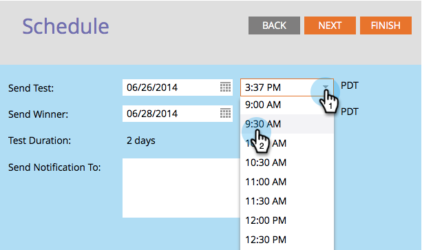

# Programar o teste A/B {#schedule-the-a-b-test}

Depois de adicionar um teste A/B a um programa de email e definir os critérios de vencedor, será necessário agendar o início do teste. Veja como.

>[!PREREQUISITES]
>
>[Adicionar um teste A/B](/help/marketo/product-docs/email-marketing/email-programs/email-program-actions/email-test-a-b-test/add-an-a-b-test.md)

>[!NOTE]
>
>Para testes de Data/Hora, você só precisa definir quando receber o resumo dos resultados do teste.

1. Selecione a data **Enviar Teste**.

1. Selecione a hora **Enviar teste**.

   

   >[!NOTE]
   >
   >Enviar teste e Enviar vencedor devem ter pelo menos 4 horas de intervalo. No entanto, para envios maiores, talvez você queira aguardar 24 horas para ter tempo suficiente para obter bons resultados.

1. Faça a mesma coisa para **Enviar Vencedor**. Insira os destinatários da notificação (opcional) e clique em **Avançar**.

   >[!NOTE]
   >
   >Somente o grupo de teste receberá as variantes de teste.

   

   >[!NOTE]
   >
   >Se você decidir declarar um vencedor manualmente, definirá **Data/hora do Envio de Relatório** em vez de **Data/hora do Término do Endereçamento**.

   Super! Quando terminar, revise o resumo e clique em Fechar.

   

   Você perceberá que o bloco **Agenda** foi atualizado.

   

   >[!NOTE]
   >
   >O agendamento de um teste A/B também configura a data de envio final ou a data de envio do relatório.

   Supondo que você já tenha definido seu público-alvo e escolhido um email, a única etapa restante é aprovar o programa.

   >[!MORELIKETHIS]
   >
   >[Aprovar/Cancelar aprovação de um programa de email](/help/marketo/product-docs/email-marketing/email-programs/email-program-actions/approve-unapprove-an-email-program.md)
