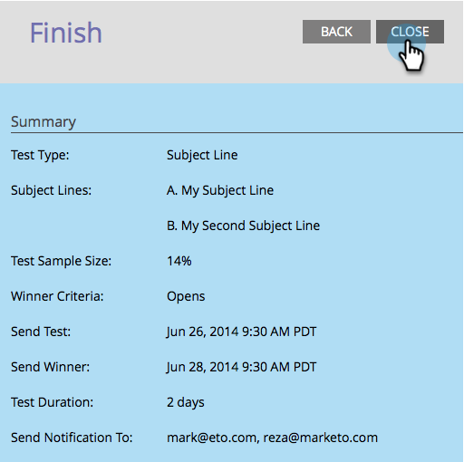

# Programar o teste A/B {#schedule-the-a-b-test}

Após adicionar um teste A/B a um programa de email e definir os critérios vencedores, será necessário agendar o início do teste. Veja como.

>[!PREREQUISITES]
>
>[Adicionar um teste A/B](/help/marketo/product-docs/email-marketing/email-programs/email-program-actions/email-test-a-b-test/add-an-a-b-test.md)

>[!NOTE]
>
>Para testes de Data/Hora, você só precisa definir quando receber o resumo dos resultados do teste.

1. Selecione o **Enviar teste** data.

1. Selecione o **Enviar teste** hora.

   

   >[!NOTE]
   >
   >Enviar teste e Enviar Vencedor devem ter um intervalo de pelo menos 4 horas. No entanto, para envios maiores, você pode querer esperar 24 horas para permitir tempo suficiente para obter bons resultados.

1. Faça a mesma coisa por **Enviar vencedor**. Insira os destinatários da notificação (opcional) e clique em **Próximo**.

   >[!NOTE]
   >
   >Somente o grupo de teste receberá as variantes de teste.

   

   >[!NOTE]
   >
   >Se você optar por declarar um vencedor manualmente, você definirá **Envio de relatório** data/hora em vez de **Concluir correspondência** data/hora.

   Super! Terminou, apenas revise o resumo e clique em Fechar.

   

   Você notará o **Agendar** mosaico atualizado.

   

   >[!NOTE]
   >
   >O agendamento de um teste A/B também configura a data final de envio ou a data de envio do relatório.

   Supondo que você já tenha definido seu público-alvo e selecionado um email, a única etapa restante é aprovar o programa.

   >[!MORELIKETHIS]
   >
   >[Aprovar/Cancelar aprovação de um programa de email](/help/marketo/product-docs/email-marketing/email-programs/email-program-actions/approve-unapprove-an-email-program.md)
