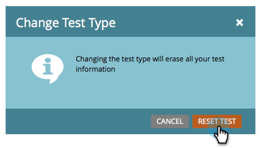
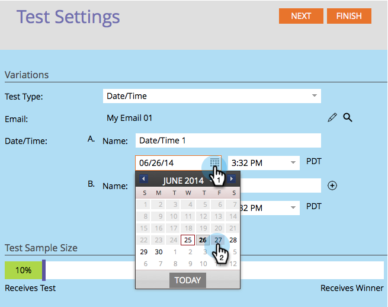
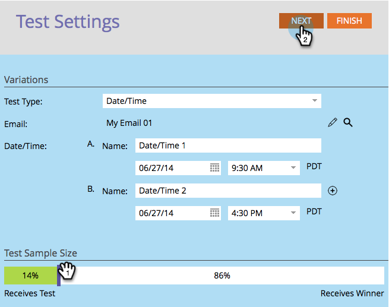

# Usar teste A/B de “Data/Hora” {#use-date-time-a-b-testing}

Você pode facilmente testar seus emails A/B. Um teste é o teste **[!UICONTROL Date/Time]**. Isso testa a hora do dia ou o dia da semana mais adequada para enviar emails. Veja como configurar isso.

>[!PREREQUISITES]
>
>[Adicionar um teste A/B](/help/marketo/product-docs/email-marketing/email-programs/email-program-actions/email-test-a-b-test/add-an-a-b-test.md)
>

1. No bloco **[!UICONTROL Email]**, clique em **[!UICONTROL Adicionar Teste A/B]**.

   

1. Uma nova janela é aberta. Selecione **[!UICONTROL Data/Hora]** para **[!UICONTROL Tipo de Teste]**.

   

1. Se você tiver informações de teste anteriores (como um teste de assunto), clique com segurança em **[!UICONTROL Redefinir Teste]**.

   

1. Selecione a data da primeira data/hora.

   

1. Selecione a hora para sua primeira data/hora.

   

1. Faça o mesmo para a segunda data/hora.

   

1. Use o controle deslizante para escolher qual porcentagem do público-alvo você deseja no teste A/B e clique em **[!UICONTROL Avançar]**.

   

   >[!NOTE]
   >
   >As diferentes variações aplicam-se a porções iguais do tamanho escolhido da amostra para ensaio.

   >[!CAUTION]
   >
   >**Recomendamos evitar definir o tamanho da amostra como 100%**. Se você estiver usando uma lista estática, definir o tamanho da amostra como 100% enviará o email para todos no público-alvo e o vencedor não descontará para ninguém. Se você estiver usando uma lista **inteligente**, definir o tamanho da amostra como 100% enviará o email para todos no público-alvo _nesse momento_. Quando o programa de email for executado novamente em uma data posterior, qualquer nova pessoa qualificada para a lista inteligente também receberá o email, pois agora está incluída no público.

   Certo, estamos um passo mais perto. Agora precisamos [definir o critério do vencedor do teste A/B](/help/marketo/product-docs/email-marketing/email-programs/email-program-actions/email-test-a-b-test/define-the-a-b-test-winner-criteria.md).
