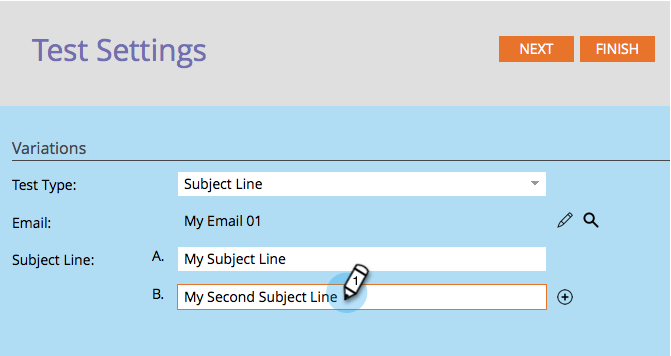

# Usar teste A/B de “Linha de assunto” {#use-subject-line-a-b-testing}

Você pode facilmente testar seus emails A/B. Um dos testes mais comuns é o teste **[!UICONTROL Linha de assunto]**.

>[!PREREQUISITES]
>
>[Adicionar um teste A/B](/help/marketo/product-docs/email-marketing/email-programs/email-program-actions/email-test-a-b-test/add-an-a-b-test.md)

1. No **[!UICONTROL Bloco de emails]**, com seu email selecionado, clique em **[!UICONTROL Adicionar Teste A/B]**.

1. A janela do editor de teste será aberta. Insira uma ou mais novas linhas de assunto.

   >[!NOTE]
   >
   >A opção **A** será preenchida previamente com as informações contidas no email selecionado.

   

   >[!TIP]
   >
   >Você pode clicar em **+** para adicionar mais linhas de assunto.

1. Use o controle deslizante para escolher qual porcentagem do público-alvo você deseja receber o teste A/B e clique em **[!UICONTROL Avançar]**.

   

   >[!CAUTION]
   >
   >**Recomendamos evitar definir o tamanho da amostra como 100%**. Se você estiver usando uma lista estática, definir o tamanho da amostra como 100% enviaria o email para todos no público-alvo e o vencedor não iria para ninguém. Se você estiver usando uma lista inteligente, definir o tamanho da amostra como 100% enviará o email para todos no público-alvo _nesse momento_. E quando o programa de email for executado novamente em uma data posterior, qualquer nova pessoa que se qualificar para a lista inteligente também receberá o email, já que agora está incluída no público.

   >[!NOTE]
   >
   >As diferentes variações de assunto levarão até mesmo partes do Tamanho da amostra de teste selecionado.

   Ok, estamos quase lá. Agora precisamos [definir o critério do vencedor do teste A/B](/help/marketo/product-docs/email-marketing/email-programs/email-program-actions/email-test-a-b-test/define-the-a-b-test-winner-criteria.md).
