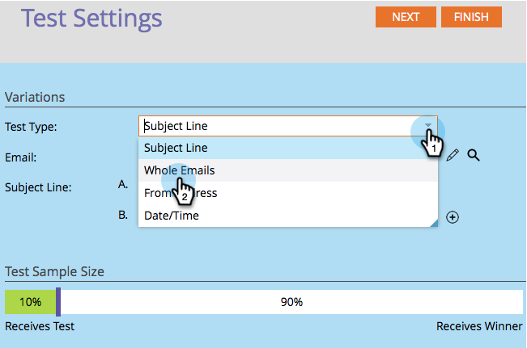
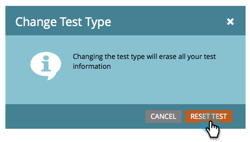
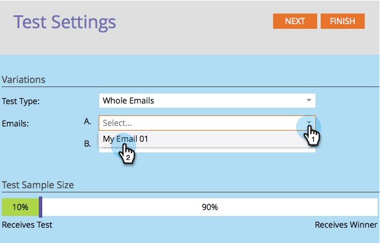
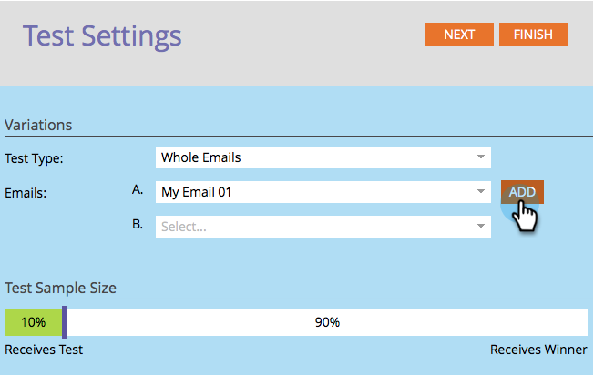

# Usar teste A/B de “Email inteiro” {#use-whole-email-a-b-testing}

Você pode facilmente testar seus emails A/B. Um grande teste é o teste **Todo o email**. Veja como configurar isso.

>[!PREREQUISITES]
>
>[Adicionar um teste A/B](/help/marketo/product-docs/email-marketing/email-programs/email-program-actions/email-test-a-b-test/add-an-a-b-test.md)

1. No bloco Email, com seu email selecionado, clique em **[!UICONTROL Adicionar Teste A/B]**.

1. Uma nova janela é aberta. Clique no menu suspenso **[!UICONTROL Tipo de teste]** e selecione **[!UICONTROL Emails inteiros]**.

   

1. Se você tiver informações de teste anteriores (como um teste de assunto), clique com segurança em **[!UICONTROL Redefinir Teste]**.

   

1. Selecione seu primeiro email.

   

1. Clique em **[!UICONTROL Adicionar]** para aplicar o email.

   

   >[!TIP]
   >
   >Você pode adicionar vários emails. No entanto, se você adicionar muitos, isso poderá retardar o processo de teste.

1. Selecione o segundo email.

   [&#128279;](assets/image2014-9-12-15-3a23-3a49.png)

1. Clique em **[!UICONTROL Adicionar]** para aplicar o segundo email. Arraste o controle deslizante para escolher qual porcentagem do público-alvo você deseja receber o teste A/B e clique em **[!UICONTROL Avançar]**.

   [&#128279;](assets/image2014-9-12-15-3a24-3a1.png)

   >[!NOTE]
   >
   >As diferentes variações enviarão partes iguais do **Tamanho da Amostra de Teste** escolhido.

   >[!CAUTION]
   >
   >**Recomendamos evitar definir o tamanho da amostra como 100%**. Se você estiver usando uma lista estática, definir o tamanho da amostra como 100% enviará o email para todos no público-alvo e o vencedor não descontará para ninguém. Se você estiver usando uma lista **inteligente**, definir o tamanho da amostra como 100% enviará o email para todos no público-alvo _nesse momento_. Quando o programa de email for executado novamente em uma data posterior, qualquer nova pessoa qualificada para a lista inteligente também receberá o email, pois agora está incluída no público.

   Ok, estamos quase lá. Agora precisamos [definir o critério do vencedor do teste A/B](/help/marketo/product-docs/email-marketing/email-programs/email-program-actions/email-test-a-b-test/define-the-a-b-test-winner-criteria.md).
