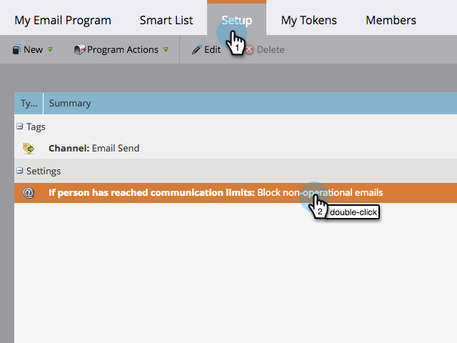

# Ativar/desativar limites de comunicação em um programa de email {#enable-disable-communication-limits-in-an-email-program}

Ao executar um programa de email, você pode optar por ignorar ou respeitar os [limites de comunicação de nível administrativo](/help/marketo/product-docs/administration/email-setup/enable-communication-limits.md). Veja como fazer isso.

>[!NOTE]
>
>Os limites de comunicação estão [definidos na seção Admin](/help/marketo/product-docs/administration/email-setup/enable-communication-limits.md) e ajudam a evitar o envio de emails demais para uma pessoa.

1. Vá para **[!UICONTROL Atividades de marketing]**.

   

1. Localize e selecione seu programa de email.

   

1. Na guia **[!UICONTROL Configuração]**, clique duas vezes no item da linha de limite de comunicação.

   

1. Por padrão, os emails não operacionais são bloqueados se os limites de comunicação forem atingidos, mas se você quiser ignorá-los, desmarque a caixa de seleção e clique em **[!UICONTROL Salvar]**.

   

   Deixar a opção **[!UICONTROL Bloquear emails não operacionais]** marcada impedirá o envio do email para qualquer pessoa que tenha recebido mais emails do que o permitido pelas configurações de administrador.
