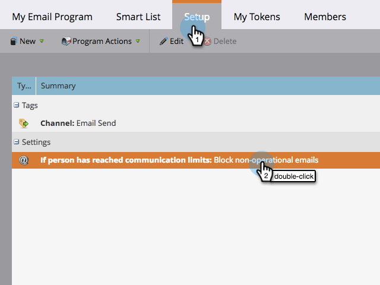

# Ativar/desativar limites de comunicação em um programa de email {#enable-disable-communication-limits-in-an-email-program}

Ao executar um programa de email, você pode optar por ignorar ou respeitar a variável [limites de comunicação no nível do administrador](/help/marketo/product-docs/administration/email-setup/enable-communication-limits.md). Aqui está como fazê-lo.

>[!NOTE]
>
>Os limites de comunicação são [definido na seção Admin](/help/marketo/product-docs/administration/email-setup/enable-communication-limits.md) e ajudá-lo a evitar o envio de emails em excesso para uma pessoa.

1. Ir para **Atividades de marketing**.

   

1. Localize e selecione seu programa de email.

   

1. Em **Configuração** , clique duas vezes no item de linha do limite de comunicação.

   

1. Por padrão, os emails não operacionais são bloqueados se os limites de comunicação forem atingidos, mas se você quiser ignorá-los, desmarque a caixa de seleção e clique em **Salvar**.

   

   Saída **Bloquear emails não operacionais** marcado impedirá o envio do email para qualquer pessoa que recebeu mais emails do que as configurações de administrador permitem.
