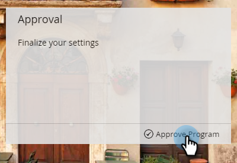

# Head Start para programas de email {#head-start-for-email-programs}

>[!PREREQUISITES]
>
>[Criar um programa de email](/help/marketo/product-docs/email-marketing/email-programs/creating-an-email-program/create-an-email-program.md)

Quando você escolhe uma data/hora para um Programa de email, ela determina quando o programa iniciará o processamento. Se você quiser que seus emails sejam iniciados no horário selecionado, o Head Start oferece essa opção, processando o programa antecipadamente.

## Head Start padrão {#standard-head-start}

1. Clique em **Atividades de marketing**.

   

1. Localize e selecione seu programa de e-mail.

   

   >[!NOTE]
   >
   >O Head Start não pode ser usado com o teste A/B.

1. No bloco Agendar, agende o email e marque a caixa **Head Start**.

   

   Com o Head Start selecionado, o programa iniciará o processamento aproximadamente 12 horas antes do horário programado. Quando o processamento for iniciado, o programa será bloqueado.

   >[!CAUTION]
   >
   >Qualquer pessoa do público-alvo que cancelar a assinatura após o bloqueio do programa ainda receberá o email. Recomendamos ajustar a notificação de cancelamento de inscrição para refletir que o cancelamento de inscrições pode levar de 1 a 2 dias úteis para ser processado.

1. Clique em **Aprovar Programa**.

   

   Após a aprovação do programa, há quatro status diferentes que podem ser vistos no bloco Aprovação.

   * **Aguardando execução:** Depois que o programa for aprovado.
   * **Processamento iniciado, aguardando execução:** O processamento está em andamento.
   * **Processamento concluído, aguardando execução:** Processamento concluído, email agora aguardando o horário agendado para ser iniciado.
   * **Concluído:** Programa concluído.

   >[!TIP]
   >
   >Deseja cancelar após o bloqueio do programa, mas antes do envio do email? Sem problemas! Basta clicar em **Anular programa** no lado inferior direito do bloco Aprovação.

   >[!NOTE]
   >
   >Se você cancelar a aprovação do programa de email com menos de 12 horas antes do tempo de execução agendado, mas mudar de ideia, precisará escolher uma nova data/hora que seja pelo menos 12 horas antes da aprovação.

## Início com fuso horário do recipient {#head-start-with-recipient-time-zone}

Nosso recurso Head Start existente exige que o programa seja agendado com pelo menos 12 horas de antecedência. O que isso significa para o Fuso horário do recipient? Lembre-se de que quando o Fuso horário do recipient está ativo, começamos a executar o programa de email à meia-noite no fuso horário mais antigo (UTC +14:00). Portanto, para habilitar **o Head Start e o Fuso Horário do Destinatário**, os programas precisam ser agendados **pelo menos 12 horas antes do fuso horário mais antigo (UTC +14:00**.)

Isso significa que, se você estiver na América/Los Angeles e quiser habilitar o Head Start e o Fuso horário do destinatário, será necessário agendar o programa com **34 horas** de antecedência. Como chegamos a esse número?

[Saiba mais](/help/marketo/product-docs/email-marketing/email-programs/email-program-actions/scheduling-with-recipient-time-zone/schedule-email-programs-with-recipient-time-zone.md) sobre como agendar programas de email com Fuso Horário do Destinatário.

>[!MORELIKETHIS]
>
>* [Agendar Seu Programa De Email](/help/marketo/product-docs/email-marketing/email-programs/email-program-actions/schedule-your-email-program.md)
>* [Agendar Programas de Email com Fuso Horário do Destinatário](/help/marketo/product-docs/email-marketing/email-programs/email-program-actions/scheduling-with-recipient-time-zone/schedule-email-programs-with-recipient-time-zone.md)
>* [Noções Básicas sobre o Fuso Horário do Destinatário](/help/marketo/product-docs/email-marketing/email-programs/email-program-actions/scheduling-with-recipient-time-zone/understanding-recipient-time-zone.md)
