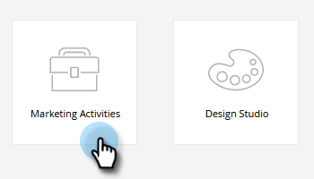
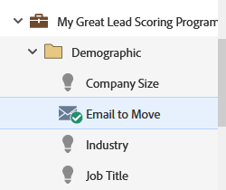

# Mover um email {#move-an-email}

Precisa mover um email de um programa para outro? Veja como.

1. Vá para **[!UICONTROL Atividades de marketing]**.

   

1. Localize o email que deseja mover, clique com o botão direito do mouse nele e selecione **[!UICONTROL Mover]**.

   

1. Selecione o **[!UICONTROL Destino]**, o **[!UICONTROL Programa]** e a **[!UICONTROL Pasta]** opcional. Selecione **[!UICONTROL Mover]**.

   

   >[!NOTE]
   >
   >Neste exemplo, estamos movendo um email para outro programa, mas você também pode mover um email para uma pasta no [!UICONTROL Design Studio].

   Você verá que seu email agora está no outro programa.

   

   >[!NOTE]
   >
   >Você também pode simplesmente arrastar e soltar seu email em um novo destino dentro da árvore.
