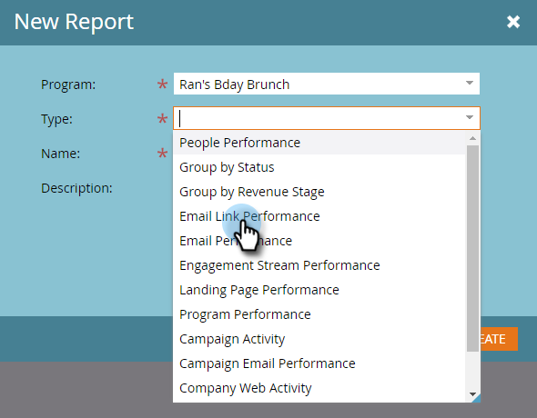

# Relatório de desempenho do link de email {#email-link-performance-report}

Crie um relatório de Desempenho do link de email para ver o desempenho dos links em seus emails.

1. [Crie um relatório em um programa](/help/marketo/product-docs/reporting/basic-reporting/creating-reports/create-a-report-in-a-program.md) e selecione **[!UICONTROL Desempenho do Link de Email]** como o tipo de relatório.

   

1. Clique em **[!UICONTROL Instalação]**.

   

1. Clique duas vezes em **[!UICONTROL Data da atividade]** em **[!UICONTROL Configurações]**.

   

1. Defina um intervalo de tempo apropriado para seu relatório. Clique em **[!UICONTROL Salvar]**.

   

1. Clique em **[!UICONTROL Relatório]**.

   

1. Ótimo! Agora você criou um relatório de Desempenho do link de email.

   

[As colunas disponíveis](/help/marketo/product-docs/reporting/basic-reporting/editing-reports/select-report-columns.md) para um relatório de Desempenho do Link de Email incluem:

<table> 
 <thead> 
  <tr> 
   <th colspan="1" rowspan="1">[!UICONTROL Coluna]</th> 
   <th colspan="1" rowspan="1">Descrição</th> 
  </tr> 
 </thead> 
 <tbody> 
  <tr> 
   <td colspan="1" rowspan="1">[!UICONTROL Link]</td> 
   <td colspan="1" rowspan="1">Agrupado por nome de email. Clique no sinal de mais (+) para ver todos os links incluídos nesse email.</td> 
  </tr> 
  <tr> 
   <td colspan="1" rowspan="1">[!UICONTROL Cliques]</td> 
   <td colspan="1" rowspan="1">O número de vezes que o link foi clicado.</td> 
  </tr> 
  <tr> 
   <td colspan="1" rowspan="1">% [!UICONTROL Cliques]</td> 
   <td colspan="1" rowspan="1">Do total de cliques em todos os links nesse email, porcentagem nesse link.</td> 
  </tr> 
  <tr> 
   <td colspan="1" rowspan="1">[!UICONTROL Pessoas]</td> 
   <td colspan="1" rowspan="1">O número de pessoas únicas que clicaram no link.</td> 
  </tr> 
  <tr> 
   <td colspan="1" rowspan="1">% [!UICONTROL Pessoas]</td> 
   <td colspan="1" rowspan="1">Do total de pessoas únicas que clicaram nos links nesse email, porcentagem neste link.</td> 
  </tr> 
 </tbody> 
</table>

>[!NOTE]
>
>Este relatório mostrará &quot;link malformado&quot; quando links inválidos/vazios forem adicionados a um email. Se você vir esta mensagem, [verifique a origem do HTML](/help/marketo/product-docs/email-marketing/general/functions-in-the-editor/edit-an-emails-html.md) no editor de email para obter links vazios ou tokens que não preenchem um link completo.

>[!TIP]
>
>Se quiser saber exatamente o que uma pessoa fez, abra o [Log de Atividades](/help/marketo/product-docs/core-marketo-concepts/smart-lists-and-static-lists/managing-people-in-smart-lists/filter-activity-types-in-the-activity-log-of-a-person.md) na página [Detalhes da pessoa](/help/marketo/product-docs/core-marketo-concepts/smart-lists-and-static-lists/managing-people-in-smart-lists/using-the-person-detail-page.md), na guia Membros do programa.

>[!MORELIKETHIS]
>
>* [Relatório de desempenho de email](/help/marketo/product-docs/email-marketing/email-programs/email-program-data/email-performance-report.md)
>* [Filtrar Assets em um Relatório de Email](/help/marketo/product-docs/reporting/basic-reporting/report-activity/filter-assets-in-an-email-report.md)
