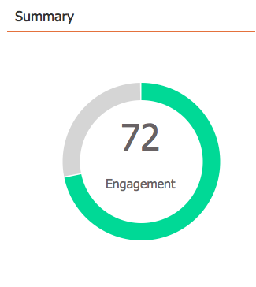

# Use o Painel Programa de e-mail {#use-the-email-program-dashboard}

Veja como seus [programas de e-mail](http://docs.marketo.com/display/docs/email+programs) estão se saindo com essa visualização de painel.

>[!NOTE]
>
>Se o programa tiver um teste A/B, verifique [Painel de Programa de e-mail - Visualização de teste A/B](../../../../product-docs/email-marketing/email-programs/email-program-actions/email-test-a-b-test/use-the-email-program-dashboard-a-b-test-view.md).

>[!NOTE]
>
>Todos os dados nesta visualização são agregações (inclui o teste A/B, bem como o envio final do email).

## Enviar por email {#email-send}

Aqui você pode ver quantos emails foram enviados, enviados e enviados.

>[!NOTE]
>
>Devido aos padrões de entrega por email que estão fora do controle do Marketing, as estatísticas Rejeitadas e Entregues são aproximadas, não exatas.

## Abre/clica {#opens-clicks}

Este gráfico mostra o número de emails abertos/clicados durante períodos de tempo específicos após a execução do programa de email.

>[!TIP]
>
>Observe como o número de aberturas/cliques diminui com o passar do tempo.

## Resumo - Envolvimento {#summary-engagement}

Isso mostra a pontuação de envolvimento [geral](../../../../product-docs/email-marketing/drip-nurturing/reports-and-notifications/understanding-the-engagement-score.md).

## Resumo - Restante {#summary-rest}

O restante dos dados exibirá Aberturas, Cliques, Taxa de clique/abertura e Cancelar inscrição.

>[!TIP]
>
>A taxa **Cancelar assinatura** no exemplo acima era tão pequena que o Marketo ampliou para oferecer uma aparência melhor. O segundo número dentro da barra é simplesmente adicionado para escala.

>[!NOTE]
>
>**Definição**
>
>**As aberturas **são contadas quando o recipient de email baixa as imagens do email, o que inclui um pixel de rastreamento inserido no mercado. Se o recipient visualização o e-mail, mas optar por não baixar suas imagens, isso não contará como uma abertura. Se as imagens forem carregadas no painel pré-visualização do recipient, isso geralmente será contado como uma abertura, mas variará com base no cliente de email.
>
>**Clique para** Abrir a porcentagem de emails que foram abertos e que tiveram um link clicado no email. Pegamos o número de cliques únicos divididos pelo número de aberturas únicas e, em seguida, multiplicamos por 100 para mostrá-los como uma porcentagem.

## Atualizar Painel {#refresh-dashboard}

Para ver os dados mais atualizados, basta clicar no ícone de atualização no painel.

>[!MORELIKETHIS]
>
>* [Use o Painel de Programa de e-mail - Visualização de teste A/B](../../../../product-docs/email-marketing/email-programs/email-program-actions/email-test-a-b-test/use-the-email-program-dashboard-a-b-test-view.md)

>

