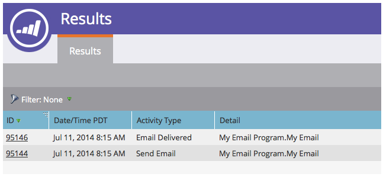

# Exibir resultados do programa de e-mail {#view-email-program-results}

Assim como na guia [!UICONTROL Resultados] das campanhas inteligentes, você pode ver as mesmas informações nos programas de email.

1. Vá para **[!UICONTROL Atividades de marketing]**.

   

1. Localize e selecione seu programa de email.

   

   >[!NOTE]
   >
   >Se o programa de email já tiver sido executado, você será direcionado diretamente ao painel do programa de email.

1. Em **[!UICONTROL Exibir]**, selecione **[!UICONTROL Painel de Controle]**.

   

1. No bloco **[!UICONTROL Público-alvo]**, clique em **[!UICONTROL Exibir resultados]**.

   

   É isso aí!

   
