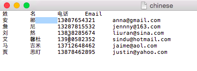
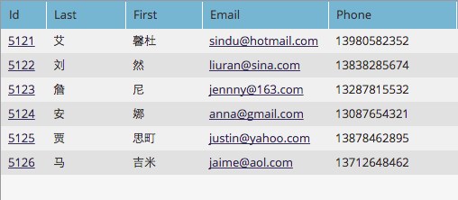

# Importar uma lista de caracteres não latinos {#import-a-non-latin-characters-list}

Tentando importar um arquivo que não esteja em inglês? A lista parece perfeita quando você a abre com o Excel.

Mas ao importá-lo para o Marketo, você pode observar que os caracteres que não são em inglês não são coletados corretamente.

Isso ocorre porque o arquivo não é salvo corretamente para que o Marketo reconheça todos os caracteres não latinos. A boa notícia é que há alguns passos simples que você pode seguir para corrigi-la.

1. Selecionar **Salvar como...** do **Arquivo** no Excel.

   

1. Choose **UTF-16 Texto Unicode (.txt)** como **Formato** opção. Isso codificará o arquivo da maneira que o Marketo pode exibi-los.

   

   >[!NOTE]
   >
   >O Marketo também é compatível com UTF-8, Shift-JIS ou EUC-JP.

1. O Excel salvará o novo arquivo como um Arquivo de texto com uma extensão .txt. Mas também converte todas as vírgulas no arquivo em guias. Precisamos mudar de volta.

   >[!TIP]
   >
   >Você pode abrir o arquivo de texto usando **Bloco de notas** se estiver usando o Windows ou **TextEdit** se estiver usando uma Mac.

   

1. Selecione uma guia no documento e copie-a.

   

1. Selecionar **Localizar e Substituir...** do **Editar** menu.

   

   >[!TIP]
   >
   >A ação equivalente para usuários do Windows é: **Editar > Substituir...**

1. Cole a guia copiada na etapa 4 na primeira caixa (a ser substituída) e digite uma vírgula na segunda caixa (substituir por). E clique em **Todos**.

   

1. E voila, todas as vírgulas voltaram e estamos prontos para rodar.

   

1. Importe o novo arquivo para o Marketo e as informações devem ser exibidas corretamente desta vez.

   

   >[!NOTE]
   >
   >Todos os campos de data/hora que estão sendo importados são tratados como Hora central. Se você tiver campos de data/hora em um fuso horário diferente, poderá usar uma fórmula do Excel para transformá-la em Hora Central (América/Chicago).

Sabemos que isso é estranho, mas funciona. Feliz importação!
