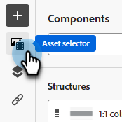

# Documento temporário {#temp-doc}

## Copiar abaixo desta parte {#copy}

### Adicionar o Assets {#add-assets}

Adicione imagens armazenadas na seção [Imagens e Arquivos](/help/marketo/product-docs/demand-generation/images-and-files/add-images-and-files-to-marketo.md){target="_blank"} da instância do Marketo Engage.

>[!NOTE]
>
>Você só pode adicionar imagens no novo designer, sem outros tipos de arquivo no momento.

1. Para acessar suas imagens, clique no ícone Seletor de ativos.

   

1. Arraste e solte a imagem desejada em um componente de estrutura.

   CAPTURA DE TELA

   >[!NOTE]
   >
   >Para substituir uma imagem existente, selecione-a e clique em **Selecionar um ativo** na guia Configurações à direita.

Clique em Ativar conteúdo de condição para adicionar conteúdo dinâmico e adaptar o conteúdo aos perfis direcionados com base em regras condicionais.

Se necessário, você pode personalizar ainda mais seu email clicando em Alternar para o editor de código no menu avançado. Isso permite editar o código-fonte do email, por exemplo, para adicionar rastreamento ou tags personalizadas do HTML.

CUIDADO
Você não pode reverter para o designer visual neste email depois de alternar para o editor de código.

Quando o conteúdo estiver pronto, clique no botão Simular conteúdo para verificar a renderização. Você pode escolher a visualização de desktop ou móvel.

Quando estiver pronto, clique em Salvar
