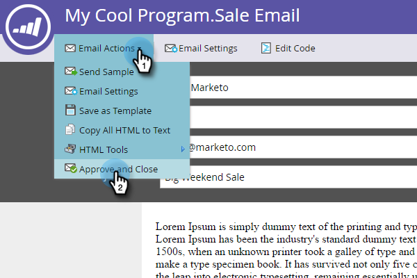

# Aprovar um email {#approve-an-email}

Os emails começam no estado de rascunho. Geralmente, eles não estão disponíveis no sistema até que você os aprove. Há algumas maneiras de aprovar um email.

## Aprove-a Usando o Menu [!UICONTROL Ações de Email] {#approve-it-using-the-email-actions-menu}

1. Localize e selecione seu email, clique no menu suspenso **[!UICONTROL Ações de Email]** e selecione **[!UICONTROL Aprovar]**.

   

## Aprovar diretamente na árvore {#approve-it-directly-in-the-tree}

1. Localize e selecione seu email, clique com o botão direito do mouse nele e selecione **[!UICONTROL Aprovar]**.

   

## Aprovar seu email no editor de email {#approve-your-email-in-the-email-editor}

1. No seu email, clique no menu suspenso **[!UICONTROL Ações de Email]** e selecione **[!UICONTROL Aprovar e Fechar]**.

   

Depois de aprovado, seu email estará pronto para uso!
