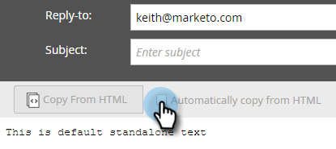

# Criar um email somente texto {#create-a-text-only-email}

Se você quiser enviar somente emails de texto, veja como criar um email que será enviado sem nenhum conteúdo do HTML.

>[!NOTE]
>
>Como as aberturas são rastreadas pelo destinatário que está baixando as imagens do email (o que inclui um pixel de rastreamento invisível), as aberturas **não** podem ser rastreadas para emails Somente texto.

1. Acesse a área **[!UICONTROL Atividades de marketing]**.

   

1. Selecione seu programa, clique no menu suspenso **[!UICONTROL Novo]** e selecione **[!UICONTROL Novo ativo local]**.

   

1. Selecione **[!UICONTROL Email]**.

   

1. Insira um **[!UICONTROL Nome]**, selecione um modelo e clique em **[!UICONTROL Criar]**.

   

1. No editor de email, clique em **[!UICONTROL Configurações de email]**.

   

1. Verifique **[!UICONTROL Somente texto]** e clique em **[!UICONTROL Salvar]**.

   

   >[!CAUTION]
   >
   >Os links não são rastreados automaticamente em emails somente texto. Veja como [Adicionar Links Rastreados a um Email com Texto](/help/marketo/product-docs/email-marketing/general/functions-in-the-editor/add-tracked-links-to-a-text-email.md).

   >[!TIP]
   >
   >Também é possível editar um email existente e alterar essa configuração. Não esqueça de aprovar o rascunho.

1. Desmarque a caixa de seleção **[!UICONTROL Copiar automaticamente do HTML]**.

   

   >[!NOTE]
   >
   >Qualquer conteúdo adicionado à seção HTML do email será ignorado quando for enviado.

1. Clique duas vezes na área de texto.

   

1. Edite o texto e clique em **[!UICONTROL Salvar]**.

   

É tão fácil quanto isso.
