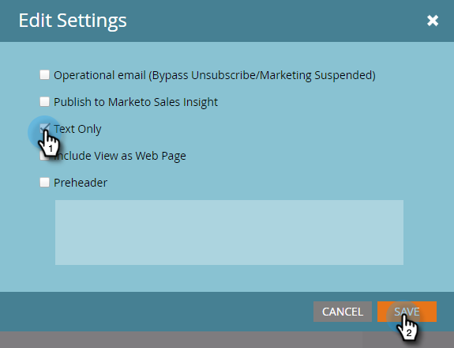

# Criar um email somente texto {#create-a-text-only-email}

Se você quiser enviar somente emails de texto, veja como criar um email que será enviado sem nenhum conteúdo em HTML.

>[!NOTE]
>
>Como as aberturas são rastreadas pelo recipient que está baixando as imagens do email (o que inclui um pixel de rastreamento invisível), as aberturas são **não** rastreável para emails somente texto.

1. Vá para a **Atividades de marketing** área.

   

1. Selecione seu programa, clique no botão **Novo** e selecione **Novo ativo local**.

   

1. Selecionar **E-mail**.

   

1. Insira um **Nome**, selecione um modelo e clique em **Criar**.

   

1. No editor de email, clique em **Configurações de email**.

   

1. Marcar **Somente texto** e clique em **Salvar**.

   

   >[!CAUTION]
   >
   >Os links não são rastreados automaticamente em emails somente texto. Veja como [Adicionar links rastreados a um email de texto](/help/marketo/product-docs/email-marketing/general/functions-in-the-editor/add-tracked-links-to-a-text-email.md).

   >[!TIP]
   >
   >Também é possível editar um email existente e alterar essa configuração. Não esqueça de aprovar o rascunho.

1. Desmarque a opção **Copiar automaticamente do HTML** caixa de seleção

   

   >[!NOTE]
   >
   >Qualquer conteúdo adicionado à seção HTML do email será ignorado quando for enviado.

1. Clique duas vezes na área de texto.

   

1. Edite o texto e clique em **Salvar**.

   

É tão fácil quanto isso.
