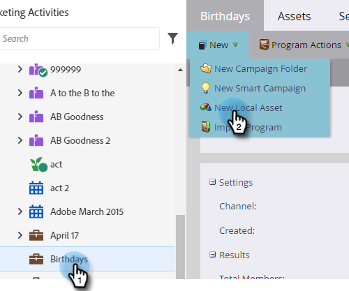

# Criar um email {#create-an-email}

Há duas formas principais de criar um email no Marketo. Vamos analisar os dois.

## Criar um email no Design Studio {#create-an-email-in-the-design-studio}

1. Vá para o **Design Studio**.

   

1. Clique no menu suspenso **Novo** e selecione **Novo email**.

   

   >[!NOTE]
   >
   >Ao criar um email no Design Studio, ele pode ser encontrado na árvore em &quot;Emails&quot;.

Simples! Por outro lado...

## Criar um email nas atividades de marketing {#create-an-email-in-marketing-activities}

1. Vá para **Atividades de marketing**.

   

1. Selecione o programa ao qual você deseja adicionar o email, clique no menu suspenso **Novo** e selecione **Novo ativo local**.

   

1. Clique em **Email**.

   

   E é isso!

Qualquer que seja o método escolhido, você será levado ao seletor de modelos.

1. Nomeie o email, clique no modelo que deseja usar e clique em **Criar**.

   

   >[!NOTE]
   >
   >Você pode escolher entre uma coleção de modelos de email responsivos prontos para uso ou um modelo que você salvou selecionando primeiro **Meus Modelos** e seguindo as mesmas etapas.

1. Insira uma linha de assunto. O limite de caracteres recomendado é 50.

   

   Dependendo do modelo escolhido, você terá opções diferentes para editar seu email. Para emails com módulos, confira [Adicionar módulos ao seu email](/help/marketo/product-docs/email-marketing/general/email-editor-2/add-modules-to-your-email.md).

Seu email foi criado, portanto, basta editar.

>[!MORELIKETHIS]
>
>[Editar O Cabeçalho Do Seu Email](/help/marketo/product-docs/email-marketing/general/creating-an-email/edit-your-email-header.md)
