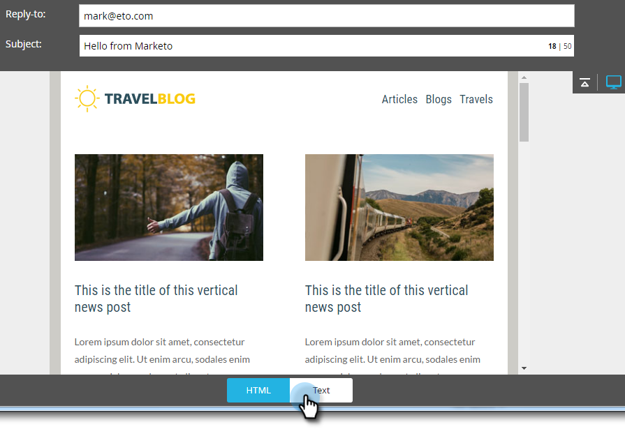
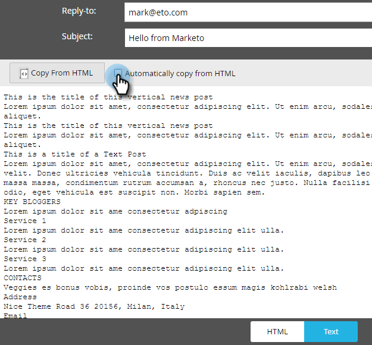
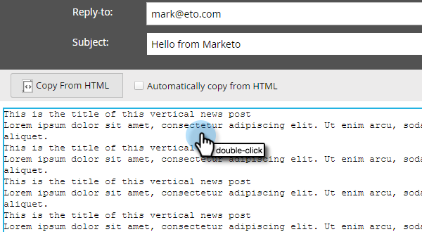
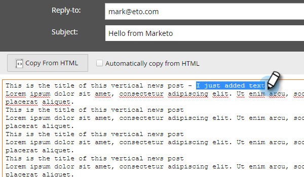
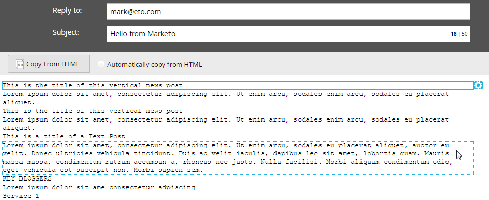

# Editar a versão de texto de um email {#edit-the-text-version-of-an-email}

Ao criar um email, talvez você queira que sua versão de texto seja redigida de forma diferente da versão do HTML. Por padrão, o Marketo copia automaticamente o conteúdo do texto de qualquer elemento rich text contido no email para a versão do texto. Veja como editá-lo.

>[!NOTE]
>
>Este não é um artigo sobre como criar um email somente texto. Para obter informações sobre isso, consulte [Criar um email somente texto](/help/marketo/product-docs/email-marketing/general/creating-an-email/create-a-text-only-email.md).

1. No editor de email, clique na guia **[!UICONTROL Texto]** na parte inferior do email.

   

1. Desmarque **[!UICONTROL Copiar automaticamente do HTML]** para fazer alterações.

   

1. Clique duas vezes na área de texto.

   

1. Faça suas edições. Depois de concluir, basta fechar o editor ou voltar para a versão do HTML. As alterações serão salvas automaticamente.

   

   Se você tiver apenas conteúdo estático, o texto será editável em um bloco grande (visto na Etapa 3). Se você tiver conteúdo dinâmico, o texto será dividido em diferentes seções editáveis, como visto abaixo.

   

>[!CAUTION]
>
>Selecionar **Copiar do HTML** ou remarcar **Copiar automaticamente do HTML** em emails com conteúdo dinâmico definirá o sinalizador Revisado como _true_ para todos os segmentos (produzindo a marca de seleção verde que indica que ele foi revisado) nas versões HTML e Text do email. Se você executar qualquer uma das ações acima, verifique seu conteúdo novamente antes de enviar.
