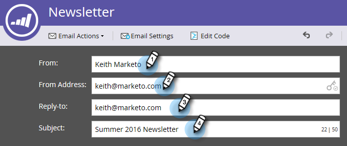
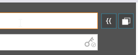

# Editar o cabeçalho do email {#edit-your-email-header}

O cabeçalho do email no Marketo é totalmente personalizável. Ele consiste em quatro campos:

* **[!UICONTROL De]** - O nome do remetente como você deseja que ele seja exibido
* **[!UICONTROL Do Endereço]** - O endereço de email do remetente como você deseja que ele seja exibido
* **[!UICONTROL Responder-para]** - O endereço de email para o qual você deseja enviar a resposta de uma pessoa (pode ser diferente de [!UICONTROL Do Endereço])
* **[!UICONTROL Assunto]** - A linha de assunto do email

Para editar esses valores, clique em cada campo e insira suas informações.

>[!TIP]
>
>Para definir um padrão De Nome e De Email, consulte [Alterar o padrão de Email e Rótulo de Origem](/help/marketo/product-docs/administration/email-setup/change-the-default-from-email-and-from-label.md).

Se quiser usar um token, clique primeiro dentro do campo desejado e, em seguida, clique no ícone de token.

Também é possível tornar o campo dinâmico usando segmentos.

O ícone de chave na extremidade direita do campo [!UICONTROL Do endereço] permite saber se você está usando uma assinatura DKIM personalizada.

O contador na extremidade direita do campo [!UICONTROL Assunto] ajuda a manter a linha de assunto abaixo do limite recomendado de 50 caracteres.

Se exceder 50 caracteres, o contador ficará vermelho para alertá-lo.

>[!MORELIKETHIS]
>
>[Visão geral do Editor de Email v2.0](/help/marketo/product-docs/email-marketing/general/email-editor-2/email-editor-v2-0-overview.md)
