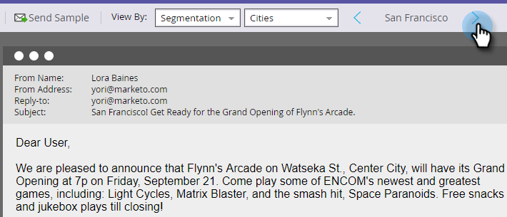

# Enviar um email de amostra {#send-a-sample-email}

É rápido e fácil enviar amostras de um email. Para enviar um email de conteúdo dinâmico, consulte [Visualizar um Email com Conteúdo Dinâmico](/help/marketo/product-docs/email-marketing/general/functions-in-the-editor/preview-an-email-with-dynamic-content.md).

>[!NOTE]
>
>Você deve ter a permissão **Acessar Banco de Dados - Executar Ações de Fluxo Único** para enviar emails de amostra.

## Enviar um email de amostra {#send-a-sample-email-1}

1. Localize e selecione seu email. Clique no menu suspenso **[!UICONTROL Ações de email]** e selecione **[!UICONTROL Enviar Amostra]**.\
   

   >[!NOTE]
   >
   >Meus tokens são resolvidos com o valor apropriado para o programa do email.

1. Insira um ou vários endereços de email para entrega. Para vários endereços de email, use vírgulas para separá-los. Clique em **[!UICONTROL Enviar]** quando terminar.

   

   >[!IMPORTANT]
   >
   >Se você inserir vários endereços de email, eles estarão visíveis para cada recipient. O primeiro endereço de email inserido será o recipient principal e cada endereço de email subsequente será um recipient CC.

   >[!TIP]
   >
   >Se você quiser resolver tokens como uma pessoa específica, escolha essa pessoa no menu suspenso **pessoa** na Etapa 2.

## Enviar um email de amostra ao editar {#send-a-sample-email-while-editing}

1. Encontre seu email, selecione-o e clique na guia **[!UICONTROL Editar rascunho]**.

   

1. Clique em **[!UICONTROL Ações de email]**, selecione **[!UICONTROL Enviar Amostra]**.

   

1. Insira um endereço de email para entrega e clique em **[!UICONTROL Enviar]**.

   

   >[!NOTE]
   >
   >O campo de acionador só é aplicável para quem utiliza [script de email](https://experienceleague.adobe.com/en/docs/marketo-developer/marketo/email-scripting).

## Enviar um email de amostra com base em um segmento {#send-a-sample-email-based-on-a-segment}

>[!PREREQUISITES]
>
>[Aplicar segmentação ao email](/help/marketo/product-docs/email-marketing/general/functions-in-the-editor/using-dynamic-content-in-an-email.md).

1. Encontre seu email, selecione-o e clique na guia **[!UICONTROL Editar rascunho]**.

   

1. Clique em **[!UICONTROL Visualizar]**.

   

1. Clique no menu suspenso **[!UICONTROL Exibir por]** e selecione **[!UICONTROL Segmentação]**.

   

1. Uma lista suspensa é exibida com segmentações disponíveis. Clique nele e selecione o desejado.

   

1. Use as setas para percorrer suas opções (nesse caso, alteramos dinamicamente a linha de assunto).

   

1. Clique em **[!UICONTROL Enviar amostra]** para receber um email de teste do seu segmento em ação.

   

   >[!TIP]
   >
   >Você também pode enviar um email de amostra com base em um segmento no modo de edição do seu email. Clique no menu suspenso **[!UICONTROL Ações de email]**, selecione **[!UICONTROL Enviar Amostra]** e escolha seu segmento.

É muito importante obter uma amostra do seu conteúdo antes de lançar uma campanha. Meça duas vezes, corte uma vez!
