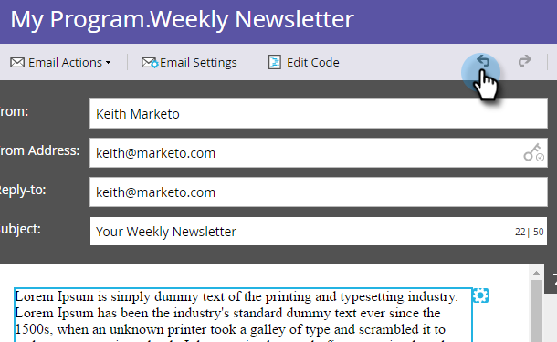
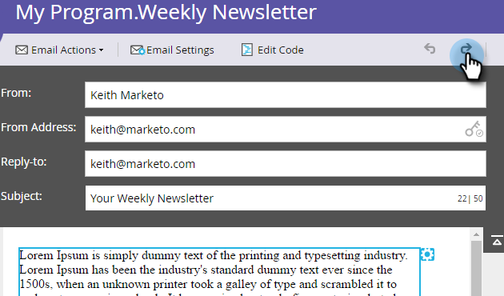

# Desfazer no editor de email {#undo-in-the-email-editor}

1. Para desfazer uma alteração, clique na seta para a esquerda.

>[!TIP]
>
>Desfazer pode retornar até 50 alterações.

1. Para refazer uma alteração, clique na seta para a direita.

   

   >[!NOTE]
   >
   >Não é possível desfazer ao editar o texto. Depois de concluído, você pode desfazer todas as alterações, desde a primeira edição até o salvamento.

   Legal! Agora é possível desfazer e refazer como um profissional.
