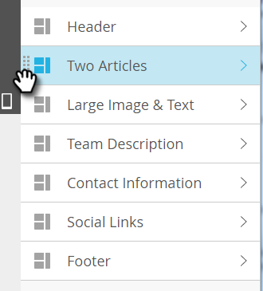

# Adicionar módulos ao email {#add-modules-to-your-email}

No [!DNL Email Editor 2.0], um módulo é uma seção do seu email que é definida no modelo. Os módulos podem conter qualquer combinação de elementos, variáveis e outro conteúdo do HTML. Adicioná-los ao seu email é fácil.

1. Crie um email. Certifique-se de escolher (ou criar) um modelo que contenha módulos.

   

   >[!NOTE]
   >
   >A maioria dos [!UICONTROL Modelos Iniciais] do Marketo contém [!UICONTROL Módulos]. Você também pode [criar o seu próprio](/help/marketo/product-docs/email-marketing/general/email-editor-2/email-template-syntax.md#modules).

1. Na extremidade direita do email, clique em **[!UICONTROL Módulos]**.

   

1. Escolha o módulo que deseja adicionar e arraste-o para seu email.

   

1. Ao arrastar o módulo sobre você verá &quot;Solte aqui&quot; aparecer entre os outros módulos. Solte o novo módulo onde deseja.

   

1. Aguarde alguns segundos e o email será atualizado automaticamente, revelando o módulo adicionado.

   

## Mover um módulo em um email {#moving-a-module-within-an-email}

Há duas maneiras de mover um módulo.

1. Identifique o módulo que deseja mover. Se não tiver certeza do nome, passe o mouse sobre ele e ele ficará realçado à direita.

   

1. Passe o mouse sobre o módulo à direita para revelar a alça. Pegue...

   

1. ...e arraste o módulo para onde deseja.

   

1. O outro método é clicar no módulo no email para selecioná-lo, revelando o ícone de engrenagem.

   

1. Clique no ícone de engrenagem e selecione **[!UICONTROL Mover para cima]** ou **[!UICONTROL Mover para baixo]**, dependendo de onde você deseja que o módulo vá.

   

Isso é tudo.

>[!MORELIKETHIS]
>
>[Sintaxe do modelo de email](/help/marketo/product-docs/email-marketing/general/email-editor-2/email-template-syntax.md)
