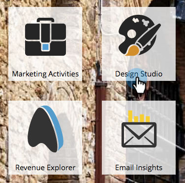

# Criar um modelo de email {#create-an-email-template}

Siga estas etapas para criar um novo template de email.

>[!NOTE]
>
>O Suporte da Marketo não está configurado para ajudar na solução de problemas do HTML personalizado. Para obter assistência da HTML, consulte um desenvolvedor da Web.

>[!CAUTION]
>
>O editor que usamos converte os valores das propriedades CSS color e background-color em minúsculas, portanto, evite usar camel case e use nomes em minúsculas ou hifens.

## Criar um novo modelo de email {#create-a-new-email-template}

1. Clique em **[!UICONTROL Design Studio]**.

   

1. Clique em **[!UICONTROL Novo]** e selecione **[!UICONTROL Novo Modelo de email]**.

   

1. Dê um nome ao novo modelo e clique em **[!UICONTROL Criar]**.

   

1. Para começar a editar seu novo modelo, clique em **[!UICONTROL Editar Rascunho]**.

   

   >[!CAUTION]
   >
   >Embora não haja limite rígido, uma vez que um modelo de email seja usado por mais de 500 emails, reaprovar esse modelo após uma atualização pode resultar em problemas de desempenho. Recomendamos que, uma vez que um modelo de email tenha 500 emails associados a ele, você crie um novo modelo.

## Salvar um email como modelo {#save-an-email-as-a-template}

Se você criou um email que gostaria de salvar como modelo para uso futuro, siga estas etapas simples.

1. Clique em **[!UICONTROL Atividades de marketing]**.

   

1. Localize e selecione seu email e clique em **[!UICONTROL Editar Rascunho]**.

   

1. Clique no menu suspenso **[!UICONTROL Ações de email]** e selecione **[!UICONTROL Salvar como modelo]**.

   

1. Clique no menu suspenso **[!UICONTROL Pasta]**, selecione onde deseja que o modelo fique e clique em **[!UICONTROL Salvar]**.

   

   E é isso!

   >[!CAUTION]
   >
   >Ao salvar um email como template, os valores de variável não serão transferidos. As variáveis continuarão a usar os padrões especificados no modelo subjacente. Os módulos disponíveis no email também não serão transferidos, a menos que tenham sido inseridos no corpo do email.

Para personalizar seu template de email, confira o artigo abaixo.

>[!MORELIKETHIS]
>
>[Sintaxe do modelo de email](/help/marketo/product-docs/email-marketing/general/email-editor-2/email-template-syntax.md)
