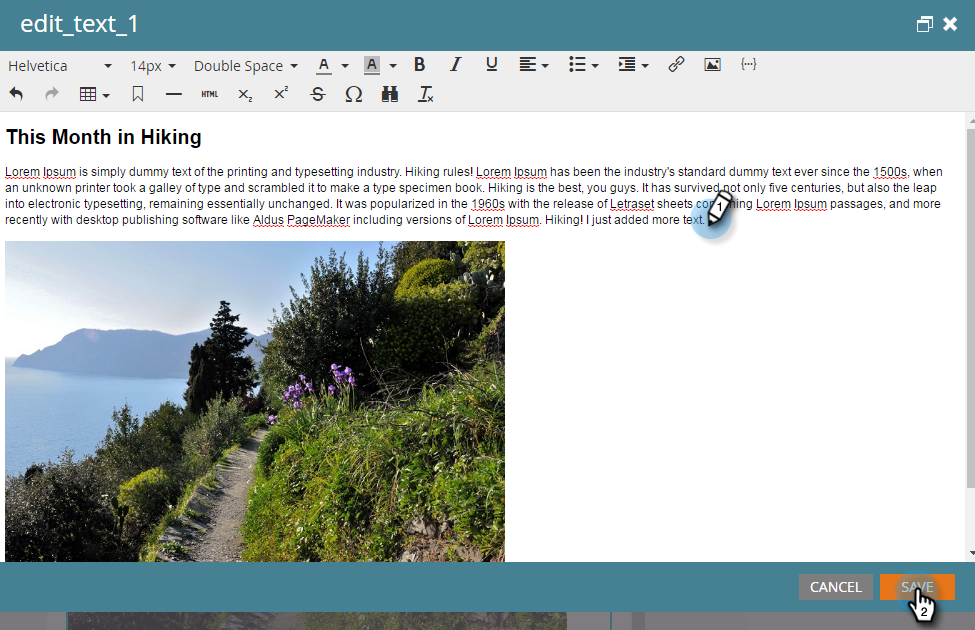
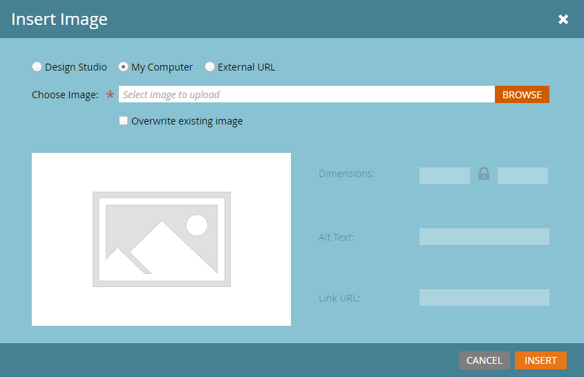
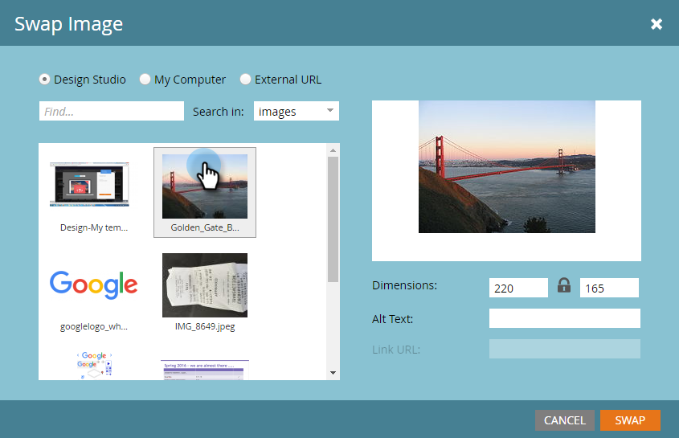

# Editar elementos em um email {#edit-elements-in-an-email}

Os emails podem conter quatro elementos diferentes: Rich text, Images, Snippets e Video. Veja como editar cada um.

## Como editar o elemento Rich Text {#how-to-edit-the-rich-text-element}

1. Localize seu email, selecione-o e clique em **Editar rascunho**.

   

1. O editor de email será aberto. Selecione Rich text (Texto formatado), clique no ícone de engrenagem e selecione **Editar**.

   

   Você também pode passar o mouse sobre o elemento no painel direito, fazendo com que o ícone de engrenagem apareça.

   

1. Adicione/edite seu texto e pressione **Salvar**.

   

   >[!NOTE]
   >
   >Também é possível adicionar imagens, tokens, tabelas e outros elementos. Consulte [Usando o Editor de Rich Text](/help/marketo/product-docs/email-marketing/general/understanding-the-email-editor/using-the-rich-text-editor.md).

   >[!CAUTION]
   >
   >Evite copiar e colar texto de uma fonte Rich Text, como um site ou um documento do Word. Em vez disso, cole rich text primeiro em um editor de texto simples, como Bloco de notas (Windows) ou TextEdit (Mac). Depois de &quot;limpo&quot;, você pode copiá-lo do editor de texto simples e colá-lo no seu email.

## Como editar o elemento de imagem {#how-to-edit-the-image-element}

1. Clique dentro do módulo com o elemento Imagem para selecioná-lo.

   

1. Clique no elemento Imagem que deseja editar, clique no ícone de engrenagem e selecione **Editar**.

   

   >[!NOTE]
   >
   >Você também pode clicar com o duplo no elemento para começar a editar.

1. O editor de imagens é exibido.

   

   Você tem três opções para inserir uma imagem. Vamos olhar cada um.

   **URL externo**

   >[!NOTE]
   >
   >Se você quiser usar um token de marketing, use essa opção. Lembre-se de que, ao usar um token, a imagem aparecerá quebrada no editor, mas será renderizada no modo Pré-visualização e no e-mail Enviar amostra.

   Para usar um URL externo, cole primeiro o URL da imagem. Altere as dimensões para atender às suas necessidades e adicione algum Texto alternativo (opcional). Em seguida, pressione **Trocar**.

   

   **Meu computador**

   Para carregar uma imagem do seu computador, clique em **Procurar**.

   

   Navegue até onde a imagem está no computador e insira-a.

   

   Altere as dimensões para atender às suas necessidades, altere o Texto alternativo (opcional) e pressione **Trocar**.

   

   >[!NOTE]
   >
   >Se você estiver substituindo uma imagem, precisará marcar a caixa **Substituir imagem existente** que aparece abaixo do URL/nome da imagem.

   **Design Studio**

   Para inserir uma imagem do Design Studio, basta localizá-la...

   

   ...E insira-o. Altere as dimensões para atender às suas necessidades, altere o Texto alternativo (opcional) e pressione **Trocar**.

   

## Como editar o elemento de trecho {#how-to-edit-the-snippet-element}

1. Clique dentro do módulo com o elemento Snippet.

   

1. Clique no elemento Snippet, depois no ícone de engrenagem e selecione **Editar**.

   

1. Encontre o snippet, selecione-o e clique em **Salvar**.

   

1. Seu snippet é preenchido.

   

## Como editar o elemento de vídeo {#how-to-edit-the-video-element}

1. Clique dentro do módulo com o elemento Vídeo.

   

1. Clique no elemento Vídeo, depois no ícone de engrenagem e selecione **Editar**.

   

1. Cole o URL do vídeo do Vimeo ou YouTube. Em seguida, clique fora da caixa URL para que a pré-visualização seja carregada. Altere as dimensões para atender às suas necessidades, adicione Texto alternativo (opcional) e pressione **Inserir**.

   

   >[!NOTE]
   >
   >Para vídeos do YouTube, use o URL completo da barra de endereços, não o URL de atalho encontrado na opção Compartilhar.

Divirta-se criando o e-mail perfeito!
