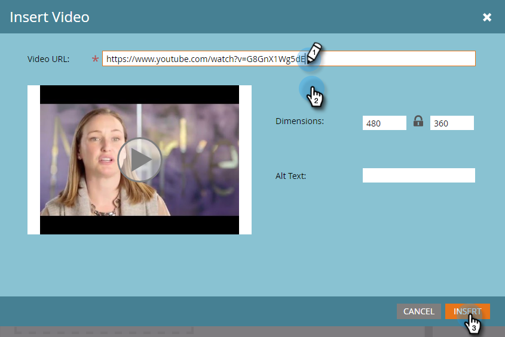

# Editar elementos em um email {#edit-elements-in-an-email}

Os emails podem conter quatro elementos diferentes: Rich text, Imagens, Trechos e Vídeo. Veja como editar cada um deles.

## Como editar o elemento de rich text {#how-to-edit-the-rich-text-element}

1. Encontre seu email, selecione-o e clique em **[!UICONTROL Editar Rascunho]**.

   

1. O editor de email será aberto. Selecione Rich text, clique no ícone de engrenagem e selecione **[!UICONTROL Editar]**.

   

   Você também pode passar o mouse sobre o elemento no painel direito, fazendo com que o ícone de engrenagem apareça.

   

1. Adicione/edite o texto e pressione **[!UICONTROL Salvar]**.

   

   >[!NOTE]
   >
   >Você também pode adicionar imagens, tokens, tabelas e outros elementos. Consulte [Usando o Editor de Rich Text](/help/marketo/product-docs/email-marketing/general/understanding-the-email-editor/using-the-rich-text-editor.md).

   >[!CAUTION]
   >
   >Evite copiar e colar texto de uma fonte de rich text, como um site ou um documento do Word. Em vez disso, cole primeiro o rich text em um editor de texto simples, como o [!DNL Notepad] (Windows) ou o [!DNL TextEdit] (Mac). Depois de &quot;limpo&quot;, você pode copiá-lo do editor de texto sem formatação e colá-lo no seu email.

## Como editar o elemento de imagem {#how-to-edit-the-image-element}

1. Clique dentro do módulo com o elemento Image para selecioná-lo.

   

1. Clique no elemento de imagem que você deseja editar, clique no ícone de engrenagem e selecione **[!UICONTROL Editar]**.

   

   >[!NOTE]
   >
   >Você também pode clicar duas vezes no elemento para começar a editar.

1. O editor de imagens é exibido.

   

   Há três opções para inserir uma imagem. Vamos analisar cada um deles.

   **URL externa**

   >[!NOTE]
   >
   >Se quiser usar um token Marketo, use essa opção. Lembre-se de que, ao usar um token, a imagem aparecerá quebrada no editor, mas será renderizada no modo de Visualização e no email Enviar amostra.

   Para usar um URL externo, cole primeiro o URL da imagem. Altere as dimensões para atender às suas necessidades e adicione [!UICONTROL Texto alternativo] (opcional). Em seguida, pressione **[!UICONTROL Swap]**.

   

   **Meu computador**

   Para carregar uma imagem do seu computador, clique em **[!UICONTROL Procurar]**.

   

   Navegue até o local em que a imagem está no computador e insira-a.

   

   Altere as dimensões de acordo com suas necessidades, altere o [!UICONTROL Texto Alt] (opcional) e pressione **[!UICONTROL Trocar]**.

   

   >[!NOTE]
   >
   >Se você estiver substituindo uma imagem, será necessário marcar a caixa **[!UICONTROL Substituir imagem existente]** que aparece abaixo do URL/nome da imagem.

   **Design Studio**

   Para inserir uma imagem do [!UICONTROL Design Studio], localize-a...

   

   ...e insira-o. Altere as dimensões de acordo com suas necessidades, altere o [!UICONTROL Texto Alt] (opcional) e pressione **[!UICONTROL Trocar]**.

   

## Como editar o elemento de trecho {#how-to-edit-the-snippet-element}

1. Clique dentro do módulo com o elemento Snippet.

   

1. Clique no elemento Trecho, depois no ícone de engrenagem e selecione **[!UICONTROL Editar]**.

   

1. Localize o seu trecho, selecione-o e clique em **[!UICONTROL Salvar]**.

   

1. O trecho é preenchido.

   

## Como editar o elemento de vídeo {#how-to-edit-the-video-element}

1. Clique dentro do módulo com o elemento de vídeo.

   

1. Clique no elemento de Vídeo, depois no ícone de engrenagem e selecione **[!UICONTROL Editar]**.

   

1. Cole a URL do vídeo de [!DNL Vimeo] ou do YouTube. Em seguida, clique fora da caixa de URL para que a visualização seja carregada. Altere as dimensões de acordo com suas necessidades, adicione [!UICONTROL Alt Text] (opcional) e pressione **[!UICONTROL Insert]**.

   

   >[!NOTE]
   >
   >Para vídeos do YouTube, use o URL completo da barra de endereços, não o URL de atalho encontrado na opção Compartilhar.

Divirta-se projetando o e-mail perfeito!
