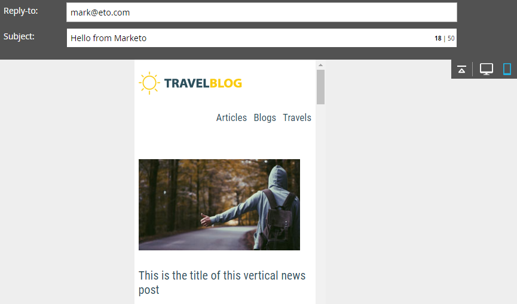

# Visão geral do Editor de email v2.0 {#email-editor-v-overview}

Ao decidir ativar o Editor de email v2.0, você notará vários novos recursos.

**Seletor de modelo de email**

Ao criar um novo e-mail, você será direcionado para o Seletor [de modelos de](email-template-picker-overview.md)e-mail.

**Editor de email**

Ao start de editar seu email, você notará que o editor tem uma aparência totalmente nova.

**Módulos**

Essas coisas no lado direito do editor são chamadas de módulos. Saiba como [adicionar módulos ao seu email](add-modules-to-your-email.md).

**Versão do texto**

A alternância entre a versão HTML e as versões de Texto do seu email agora está em uma guia útil na parte inferior. Saiba como [editar a versão de texto de um email](../../../../product-docs/email-marketing/general/creating-an-email/edit-the-text-version-of-an-email.md).

**Cabeçalho do email**

Quer mais espaço de design? O cabeçalho do email pode ser ocultado depois que você terminar de [editá-lo](../../../../product-docs/email-marketing/general/creating-an-email/edit-your-email-header.md). Basta clicar neste ícone...

...e o cabeçalho desaparece.

**Pré-visualização de seu email**

Por padrão, o e-mail exibe a aparência dele em uma área de trabalho, conforme indicado pelo ícone azul realçado. Se você clicar no ícone à direita...

...você verá como seu email será renderizado em um dispositivo móvel.

Para obter uma pré-visualização maior, clique em **Pré-visualização** no canto superior direito do email.

A visualização padrão ali é desktop...

...mas você também pode ver como será a aparência em um dispositivo móvel. Você também pode pré-visualização a versão do texto! Basta clicar em **Editar rascunho** no canto superior direito para retomar a edição.

**Ações de email**

Em Ações **de** email, você notará alguns novos recursos. **Carregue uma imagem ou um arquivo** e **obtenha imagens da Web**. Você também pode salvar o e-mail como um novo modelo de e-mail. Tudo o que você tem que fazer é dar um nome e um destino.

>[!CAUTION]
>
>Ao salvar um email como modelo, os valores de variável não serão transmitidos. As variáveis continuarão a usar os padrões especificados no modelo subjacente. Os módulos disponíveis no email também não serão carregados, a menos que tenham sido inseridos no corpo do email.

>[!NOTE]
>
>** [Capturar imagens da Web](../../../../product-docs/demand-generation/images-and-files/grab-the-images-from-a-web-page.md)** funciona exatamente como no Design Studio.

**Desative a opção Abrir rastreamento** em Configurações **de** email, você pode desativar o rastreamento aberto, se necessário.

**Configurações de email**

Você tem a opção de adicionar um Preheader. Um Preheader é o texto resumido curto após a linha de assunto quando os emails são exibidos em sua caixa de entrada.

>[!CAUTION]
>
>Os tokens não funcionam no Preheader ao usar o editor de email. Para usar um token no Preheader, ele deve estar em seu próprio HTML em um modelo de email.

Muitos novos recursos! Divirta-se!

>[!NOTE]
>
>**Mergulho profundo**
>
>Se você quiser se aprofundar ainda mais, dê uma olhada neste vídeo útil.

>[!NOTE]
>
>**Artigos relacionados**
>
>* [Sintaxe do modelo de email](email-template-syntax.md)

>

