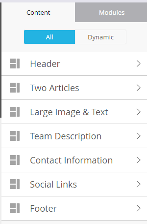
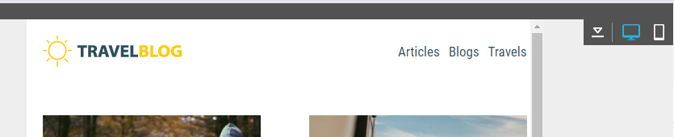
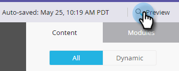
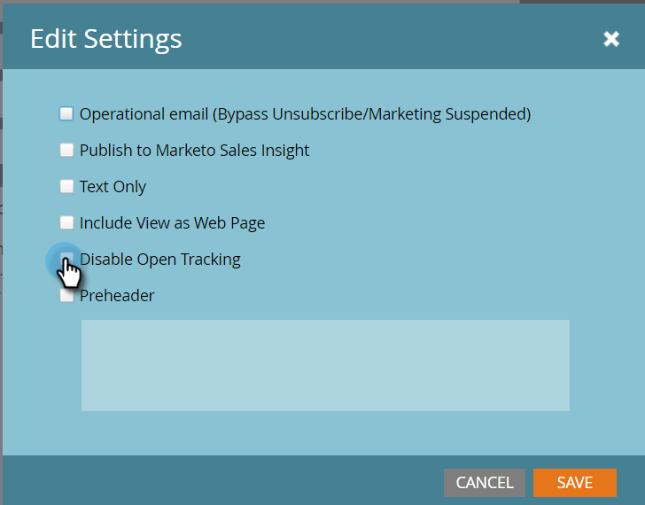

# Visão geral do Editor de email v2.0 {#email-editor-v2-overview}

Visão geral do editor de email clássico.

>[!IMPORTANT]
>
>Embora não haja uma data exata definida, o editor de email clássico provavelmente será descontinuado em algum momento de 2026 (quando definida, anunciaremos a data exata). É altamente recomendável começar a adoção do [Designer de email](/help/marketo/product-docs/email-marketing/email-designer/overview.md){target="_blank"} avançado, pois ele tem muitos recursos não disponíveis no editor clássico.

**Seletor de modelos de email**

Ao criar um novo email, você é direcionado ao [Seletor de modelos de email](/help/marketo/product-docs/email-marketing/general/email-editor-2/email-template-picker-overview.md).

**Editor de email**

Ao começar a editar seu email, você observará que o editor tem uma aparência totalmente nova.

**Módulos**

Esses itens no lado direito do editor são chamados de módulos. Saiba como [adicionar módulos ao email](/help/marketo/product-docs/email-marketing/general/email-editor-2/add-modules-to-your-email.md).

**Versão de texto**

Agora é possível alternar entre as versões HTML e de texto do email em uma guia prática na parte inferior. Saiba como [editar a versão de texto de um email](/help/marketo/product-docs/email-marketing/general/creating-an-email/edit-the-text-version-of-an-email.md).

**Cabeçalho de email**

Quer mais espaço de design? O cabeçalho do email poderá ser ocultado depois que você terminar de [editá-lo](/help/marketo/product-docs/email-marketing/general/creating-an-email/edit-your-email-header.md). Basta clicar neste ícone...

...e o cabeçalho é recolhido.

**Pré-visualização do email**

Por padrão, o email é exibido da mesma forma que seria em um desktop, conforme indicado pelo ícone azul destacado. Se você clicar no ícone à direita...

...verá como o email será renderizado em um dispositivo móvel.

Para uma visualização maior, clique em **[!UICONTROL Visualização]** no canto superior direito do email.

A visualização padrão é desktop...

...mas você também pode ver como ele ficará em um dispositivo móvel. Você também pode visualizar a versão em texto. Basta clicar em **[!UICONTROL Editar rascunho]** no canto superior direito para retomar a edição.

**[!UICONTROL Ações de email]**

Em **[!UICONTROL Ações de email]**, você observará alguns novos recursos. **[!UICONTROL Fazer upload de uma imagem ou arquivo]** e **[!UICONTROL Capturar imagens da web]**. Você também pode salvar o próprio email como um novo modelo de email. Tudo o que você precisa é dar um nome e um destino.

>[!CAUTION]
>
>Ao salvar um email como modelo, os valores de variável não serão transferidos. As variáveis continuarão a usar os padrões especificados no modelo subjacente. Os módulos disponíveis no email também não serão transferidos, a menos que tenham sido inseridos no corpo do email.

>[!NOTE]
>
>**[[!UICONTROL Capturar imagens da web]](/help/marketo/product-docs/demand-generation/images-and-files/grab-the-images-from-a-web-page.md)** funciona exatamente como no [!UICONTROL Design Studio].

Com a opção **[!UICONTROL Desabilitar rastreamento de abertura]** em **[!UICONTROL Editar configurações]**, você pode desabilitar o rastreamento de abertura, se necessário.

**[!UICONTROL Editar configurações]**

Você tem a opção de adicionar um [!UICONTROL Pré-cabeçalho]. Um [!UICONTROL Pré-cabeçalho] é o texto curto de resumo após a linha de assunto quando os emails são exibidos em sua caixa de entrada.

>[!CAUTION]
>
>Os tokens não funcionam no [!UICONTROL Pré-cabeçalho] ao usar o editor de email. Para usar um token no [!UICONTROL Pré-cabeçalho], ele deve ser feito por meio do seu próprio HTML em um modelo de email.

Muitos recursos novos excelentes. Divirta-se.

>[!NOTE]
>
>Se você quiser se aprofundar, assista a este [vídeo](https://nation.marketo.com/videos/1463).

>[!MORELIKETHIS]
>
>[Sintaxe do modelo de email](/help/marketo/product-docs/email-marketing/general/email-editor-2/email-template-syntax.md)
