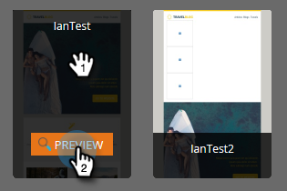

# Visão geral do Seletor de modelo de email {#email-template-picker-overview}

Ao [criar um email](/help/marketo/product-docs/email-marketing/general/creating-an-email/create-an-email.md), você tem vários modelos gratuitos para escolher. Você também pode criar seu próprio modelo e salvá-lo para uso futuro.

**Nome** será o nome do email criado com base no modelo, não o modelo em si. A **Descrição** também se aplica ao email e é opcional.

Se seu email for crítico e você quiser que ele contorne os Limites de Comunicação, [torne-o operacional](/help/marketo/product-docs/email-marketing/general/functions-in-the-editor/make-an-email-operational.md) marcando a caixa. **Abrir no editor** é selecionado por padrão e significa simplesmente que você deseja começar a editar seu novo email imediatamente. **Criar** significa: criar!

**Modelos iniciais** inclui uma coleção de modelos de email responsivos prontos para uso. Você pode usá-los como estão ou personalizá-los como desejar.

**Meus Modelos** consiste em todos os modelos que você criou. Você também pode ter pastas.

Todas as pastas exibidas em Emails > Modelos na árvore do Design Studio estarão disponíveis em **Meus Modelos**.

Para visualizar um modelo, passe o mouse sobre a miniatura e clique em **Visualizar**. Você também pode clicar duas vezes sobre ele.

O pré- visualizador mostra-lhe como o modelo irá renderizar em uma máquina de trabalho...

...e um dispositivo móvel.

Se você gostar deste modelo, escolha-o clicando em **Selecionar** na parte inferior direita. Quer continuar procurando? Clique em **X** no canto superior direito. Use as setas para a esquerda e para a direita para percorrer os modelos.

Além disso, é possível clicar com o botão direito do mouse em uma miniatura de modelo para obter mais opções.

>[!NOTE]
>
>Uma coisa legal sobre miniaturas de modelo é, eles estão ao vivo. Portanto, se você fizer uma alteração em um modelo, a miniatura será alterada junto com ele.

Muito legal!

>[!MORELIKETHIS]
>
>* [Sintaxe do modelo de email](/help/marketo/product-docs/email-marketing/general/email-editor-2/email-template-syntax.md)
>* [Criar um email](/help/marketo/product-docs/email-marketing/general/creating-an-email/create-an-email.md)
