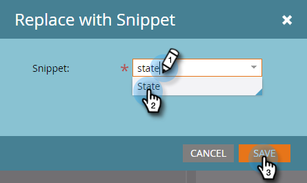
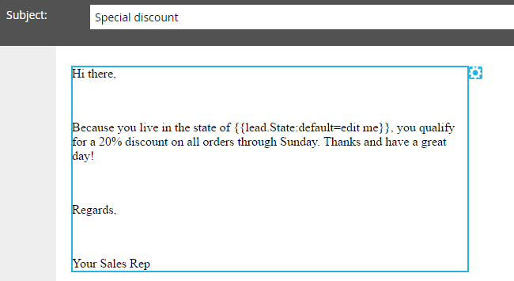

# Adicionar um snippet a um email {#add-a-snippet-to-an-email}

Os trechos são blocos reutilizáveis de rich text e gráficos que podem ser usados em emails e landing pages.

>[!PREREQUISITES]
>
>[Criar um trecho](/help/marketo/product-docs/personalization/segmentation-and-snippets/snippets/create-a-snippet.md)

>[!NOTE]
>
>Você não pode incorporar nenhuma [sintaxe de email do Marketo](/help/marketo/product-docs/email-marketing/general/email-editor-2/email-template-syntax.md)em trechos; ela **não** funcionará em um email. Os trechos devem ser apenas conteúdo do corpo (HTML + TEXT).

1. Encontre seu email, selecione-o e clique em **[!UICONTROL Editar Rascunho]**.

   

1. Selecione a área editável que você deseja converter em um trecho, clique no ícone de engrenagem e selecione **[!UICONTROL Substituir pelo trecho]**.

   

1. Selecione o trecho de sua escolha e clique em **[!UICONTROL Salvar]**.

   

   >[!NOTE]
   >
   >Somente os trechos aprovados são exibidos na lista suspensa.

   

   >[!NOTE]
   >
   >Cada vez que você atualizar e aprovar o trecho, as alterações serão refletidas no email. O email será rascunhado a menos que você aprove o trecho com [Sem rascunho](/help/marketo/product-docs/administration/users-and-roles/enable-no-draft-for-snippets.md).

Essa é uma maneira rápida e fácil de reutilizar conteúdo dinâmico.
