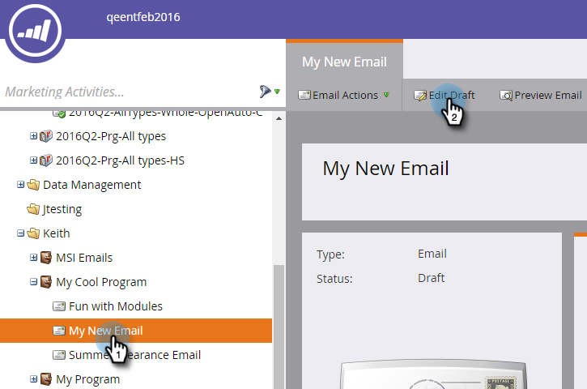

# Adicionar um link “Exibir como página da Web” a um email {#add-a-view-as-web-page-link-to-an-email}

Os emails têm recursos limitados (CSS limitado e sem JavaScript ou formulários). Use Exibir como página da Web para fornecer um link para mostrar seu email em um navegador. Isso criará um cookie no recipient usando o [!DNL Munchkin].

>[!NOTE]
>
>* Ao criar um novo email, a opção Exibir como página da Web não está ativada. Se você ativá-lo e clonar o email, essa configuração será copiada.
>
>* Os links &quot;Exibir como página da Web&quot; expiram após seis meses.

1. Selecione seu email e clique em **[!UICONTROL Editar Rascunho]**.

   

1. No editor de email, clique em **[!UICONTROL Configurações de email]**.

   

1. Marque a caixa **[!UICONTROL Incluir exibição como link de página da Web]** e clique em **[!UICONTROL Salvar]**.

   

Veja um exemplo de como ele é:

>[!TIP]
>
>Você não verá o link Exibir como página da Web até enviar o email. Envie a si mesmo um teste para visualizar.

Para alterar o texto padrão, consulte [Editar a Mensagem &quot;Exibir como Página da Web&quot;](/help/marketo/product-docs/administration/email-setup/edit-the-view-as-web-page-message.md).
