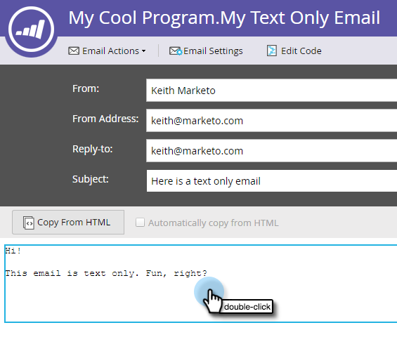

# Adicionar links rastreados a um email de texto {#add-tracked-links-to-a-text-email}

>[!PREREQUISITES]
>
>* [Criar um Email Somente Texto](/help/marketo/product-docs/email-marketing/general/creating-an-email/create-a-text-only-email.md)
>* [Editar elementos em um email](/help/marketo/product-docs/email-marketing/general/email-editor-2/edit-elements-in-an-email.md)

Os links de texto de email podem ser rastreados no Marketo. Vamos ver como funciona.

1. Selecione seu email e clique em **Editar Rascunho**.

1. Selecione seu email e clique em **[!UICONTROL Editar Rascunho]**.

   

1. Clique duas vezes na área editável à qual deseja adicionar o link.

   

1. Insira a URL com colchetes duplos, desta forma: `[[www.domain.com/path/page.html]]`.

   

   >[!CAUTION]
   >
   >Se um email tiver sido enviado há mais de 365 dias **e** ninguém tiver clicado em nenhum de seus links nos últimos 180 dias, o Marketo Engage removerá a rota para a URL do nosso banco de dados, o que causará a quebra do link. Se precisar que o link seja permanente, não use o rastreamento.

1. Feche o editor e não se esqueça de aprovar o rascunho.

   

>[!NOTE]
>
>A funcionalidade da classe mktNoTok não funciona com links rastreáveis em emails de texto. Somente para emails do HTML.
