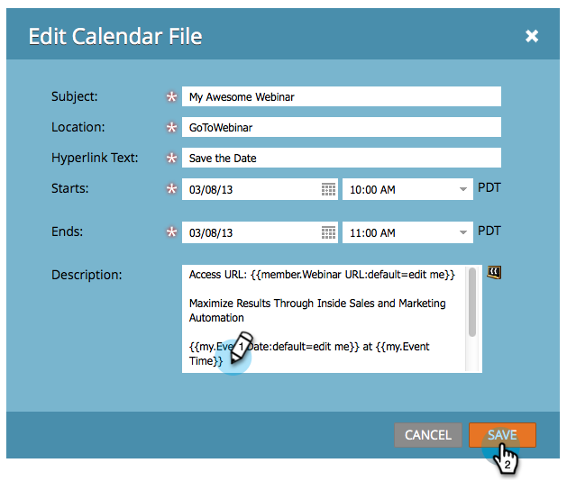

# Criar um arquivo de evento de calendário (.ics) {#create-a-calendar-event-ics-file}

Um token de Arquivo de calendário permite adicionar um link de evento de calendário (.ics) aos emails e páginas de aterrissagem do Marketo.

1. Dentro do seu programa, vá para a guia **[!UICONTROL Meus tokens]**.

   

1. Arraste um token de **[!UICONTROL Arquivo de calendário]** para a tela.

   

1. Insira um **Nome do token** e clique em **[!UICONTROL Clicar para editar]**.

   

1. Insira os detalhes e clique em **[!UICONTROL Salvar]**.

   

Missão cumprida! Certifique-se de testá-lo.

>[!MORELIKETHIS]
>
>* [Incluir um Evento de Calendário (.ics) em um Email](/help/marketo/product-docs/email-marketing/general/functions-in-the-editor/include-a-calendar-event-ics-in-an-email.md)
>* [Incluir um Arquivo ICS de Evento de Calendário em uma Página de Aterrissagem](/help/marketo/product-docs/demand-generation/landing-pages/personalizing-landing-pages/include-a-calendar-event-ics-file-in-a-landing-page.md)
