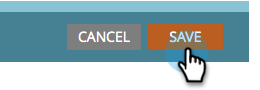

# Desativar o rastreamento para um link de email {#disable-tracking-for-an-email-link}

Às vezes, você não quer habilitar a **URL de rastreamento do Marketo** em um link em um email. Isso é útil quando a página de destino não suporta parâmetros de URL e pode resultar em um link quebrado.

Além disso, se um email tiver sido enviado há mais de 365 dias **e** ninguém tiver clicado em nenhum de seus links nos últimos 180 dias, o Marketo Engage removerá a rota para a URL do nosso banco de dados, o que causará a quebra do link. Portanto, se você precisar que o link seja permanente, desative o rastreamento.

1. Selecione seu email e clique em **[!UICONTROL Editar Rascunho]**.

   

1. Clique duas vezes na seção editável que contém o link.

   

1. Clique no link em questão e no botão **Inserir/Editar Link**.

   

1. Na janela pop-up Editar link, desmarque a caixa de seleção **[!UICONTROL Rastrear link]**.

   

1. Você perceberá que a **[!UICONTROL caixa Incluir mkt_tok]** desaparece. Clique em **[!UICONTROL Aplicar]**.

   

   >[!TIP]
   >
   >Se você desmarcar apenas **Incluir mkt_tok**, ainda permitirá que o link seja rastreado; porém, após o redirecionamento, a URL de destino não incluirá o parâmetro de cadeia de caracteres de consulta mkt_tok. Esse parâmetro é usado pelas páginas de aterrissagem do Marketo e pelo Munchkin para garantir o rastreamento adequado das atividades das pessoas (como quando uma pessoa cancela a assinatura de um email). Você deve evitar o uso desse recurso, a menos que esteja vendo um comportamento estranho em seu site devido à presença do parâmetro.

1. Clique em **[!UICONTROL Salvar]**.

   

   >[!CAUTION]
   >
   >Se você deseja desabilitar o rastreamento de cliques para um link em um Modelo de email ou para a [versão de texto](/help/marketo/product-docs/email-marketing/general/creating-an-email/edit-the-text-version-of-an-email.md){target="_blank"} de um email, adicione o `mktNoTrack` no *início* da cadeia de caracteres, não o fim, como neste exemplo: `<a class="mktNoTrack" href="https://www.mywebsite.com">This link does not have tracking</a>`. Caso contrário, pode fazer com que o link desapareça. Se precisar de ajuda para implementar o código acima, consulte o desenvolvedor da Web.
