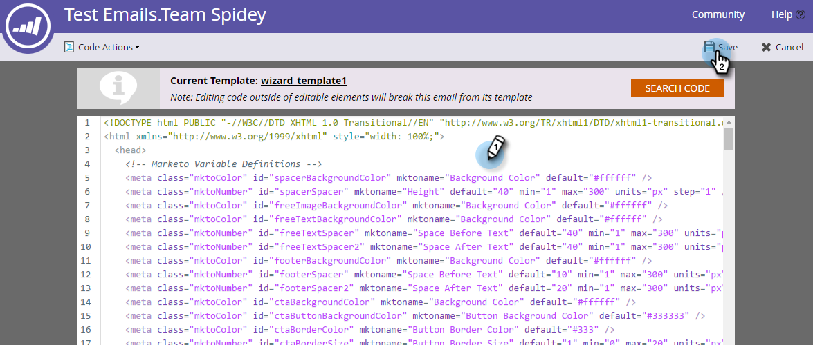

# Editar o HTML de um email {#edit-an-emails-html}

Às vezes, pode ser necessário modificar o HTML subjacente de um email. Às vezes, você pode usar um sistema externo para projetar e criar o código do seu email. De qualquer maneira, você pode importar e/ou editar facilmente o código do no editor de email.

## Editar HTML {#edit-html}

1. Selecione seu email e clique em **[!UICONTROL Editar Rascunho]**.

   

1. Clique em **[!UICONTROL Editar código]**.

   

1. Faça as alterações. Clique em **[!UICONTROL Salvar]** quando terminar.

   

   >[!NOTE]
   >
   >Mude o que quiser. Você pode substituir a HTML inteira ou fazer pequenos ajustes.

1. Clique no menu suspenso **[!UICONTROL Ações de Código]** para baixar o código como um arquivo .html, embutir seu CSS ou validar o HTML.

   

   >[!NOTE]
   >
   >A prática recomendada para emails é tornar todos os estilos em linha. Vários clientes de email não oferecem suporte para CSS na seção `<head>`.

## Quebra de um email de seu modelo {#breaking-an-email-from-its-template}

Estas alterações de código **não** interromperão um email de seu modelo:

* Editar o conteúdo de qualquer módulo (incluindo adicionar novos elementos dentro do módulo)
* Adicionar um novo módulo ao contêiner
* Excluindo um módulo do contêiner

* Alteração de atributos específicos do mkto (por exemplo, &quot;mktoName&quot; ou &quot;mktoImgUrl&quot;) de qualquer Elemento fora de um Módulo
* Editar o conteúdo de qualquer elemento (rich text, imagem, vídeo, etc.) fora de um módulo

As seguintes ações que você pode executar no editor de código **quebrarão o email com base em seu modelo:**

* Alterar qualquer coisa no código fora de um elemento ou módulo
* Adicionar ou alterar atributos não mkto (por exemplo, &quot;id&quot; ou &quot;style&quot;) de qualquer elemento fora de um módulo
* Excluindo um elemento que está fora de um módulo

## Código de pesquisa {#search-code}

Use a funcionalidade Código de pesquisa para localizar e substituir com eficiência o conteúdo no código HTML de seu email.

1. No código do seu email, clique em **[!UICONTROL Pesquisar código]**.

   

1. Insira o que você deseja localizar e clique em **[!UICONTROL Localizar Próximo]** para avançar a pesquisa ou em **[!UICONTROL Localizar Anterior]** para retroceder. Você também tem a opção de **[!UICONTROL Substituir]** e **[!UICONTROL Substituir tudo]**.

   

1. Clique em **[!UICONTROL Fechar]** quando terminar.

   

   >[!NOTE]
   >
   >O Código de Pesquisa também está disponível no [editor de Modelo de Email](/help/marketo/product-docs/email-marketing/general/email-editor-2/create-an-email-template.md).

Recomendamos que você continue a editar seus emails usando a funcionalidade integrada do Marketo, mas esse editor de código oferece flexibilidade se você precisar.
