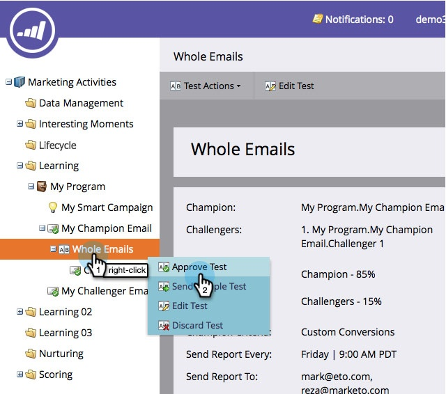

# Champion/Challenger: Aprove Seu Teste De Email {#champion-challenger-approve-your-email-test}

A etapa final na configuração do teste de email para aprová-lo. Veja como.

>[!PREREQUISITES]
>
>[Configurar alertas de relatório](/help/marketo/product-docs/email-marketing/general/functions-in-the-editor/email-tests-champion-challenger/champion-challenger-analytics.md#configure-report-alerts)

1. Vá para **[!UICONTROL Atividades de marketing]**.

   

1. Localize e clique com o botão direito no **[!UICONTROL Teste de Email]** e depois clique em **[!UICONTROL Aprovar Teste]**.

   

   >[!NOTE]
   >
   >Ao aprovar um teste de **Email inteiro**, aprove primeiro o email desafiante.

   >[!NOTE]
   >
   >Para enviar o teste, escolha o email ao qual você adicionou o teste na etapa de fluxo **Enviar Email** da sua campanha de acionador. Você também tem a opção de inserir esse email em um fluxo de um programa de engajamento. Os emails de Especialista/Desafiador não funcionarão em campanhas em lote.

   Não foi fácil? Depois de receber alguns relatórios, você vai querer declarar um campeão.

   >[!MORELIKETHIS]
   >
   >* [Champion/Challenger: declare um Champion](/help/marketo/product-docs/email-marketing/general/functions-in-the-editor/email-tests-champion-challenger/champion-challenger-declare-a-champion.md)
   >* [Champion/Challenger: descartar um teste de email](/help/marketo/product-docs/email-marketing/general/functions-in-the-editor/email-tests-champion-challenger/champion-challenger-discard-an-email-test.md)
