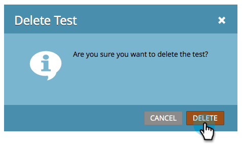

# Controlador/variante: descartar um teste de email {#champion-challenger-discard-an-email-test}

Se, a qualquer momento, você decidir que não deseja continuar executando seu teste de email, poderá descartá-lo. Veja como.

>[!PREREQUISITES]
>
>[Champion/Challenger: Aprove Seu Teste De Email](/help/marketo/product-docs/email-marketing/general/functions-in-the-editor/email-tests-champion-challenger/champion-challenger-approve-your-email-test.md)

1. Vá para **[!UICONTROL Atividades de marketing]**.

   

1. Localize seu email, clique com o botão direito em seu email de teste e clique em **[!UICONTROL Descartar Teste]**.

   

1. Clique em **[!UICONTROL Excluir]** para confirmar.

   

   Pronto! Se você decidir configurar um teste novamente, vá em frente e [adicione um desafiante/campeão de email](/help/marketo/product-docs/email-marketing/general/functions-in-the-editor/email-tests-champion-challenger/add-an-email-champion-challenger.md).
