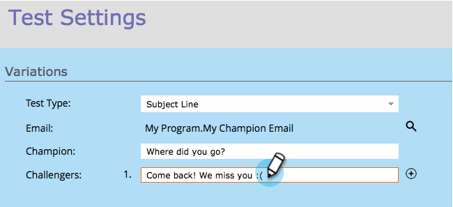

# Campeão/Desafiador: Linha de assunto {#champion-challenger-subject-line}

É possível testar facilmente várias linhas de assunto. Quando o teste terminar, envie emails com o mais eficaz. Aqui está como fazer isso.

>[!PREREQUISITES]
>
>[Adicionar um campeão/desafiador de e-mail](/help/marketo/product-docs/email-marketing/general/functions-in-the-editor/email-tests-champion-challenger/add-an-email-champion-challenger.md)

1. No editor de teste de email, selecione **Linha do assunto** no menu suspenso **Tipo de teste**.

   

   >[!NOTE]
   >
   >Em um teste de assunto, a primeira linha de assunto inserida é designada como **Champion**. As linhas de assunto subsequentes são chamadas **Challengers**.

1. Digite as linhas de assunto para **Challengers**.

   

   >[!TIP]
   >
   >Se quiser mais de um candidato, clique no sinal de mais e insira outra linha de assunto.

1. Arraste o controle deslizante para decidir a divisão de porcentagem entre as pessoas que recebem a linha de assunto campeã e a(s) linha(s) de assunto desafiante(s).

   

   >[!NOTE]
   >
   >**Exemplo**
   >
   >Na distribuição mostrada acima, 10% da audiência total especificada na lista inteligente recebe um dos emails com a linha de assunto desafiante e 90% recebem emails com a linha de assunto campeã. Emails com várias linhas de assunto desafiadoras compartilham os 10% igualmente. Quando o teste terminar, você pode declarar um vencedor manualmente. A partir daí, todas as pessoas futuras receberão o conteúdo com melhor desempenho.

   Para ganhar confiança estatística, verifique se a porcentagem escolhida inclui pessoas suficientes, para que seu teste seja válido. Não se deixe enganar por resultados inconclusivos. [Mais informação do que você já quis sobre confiança](http://en.wikipedia.org/wiki/Confidence_interval) estatística.

1. Clique em **Próximo**.

   

   Progresso! Vamos continuar com isso.

   >[!MORELIKETHIS]
   >
   >[Campeão/Desafiador: Definir critérios de campeão](/help/marketo/product-docs/email-marketing/general/functions-in-the-editor/email-tests-champion-challenger/champion-challenger-define-champion-criteria.md)
