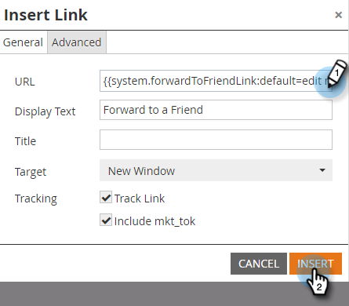
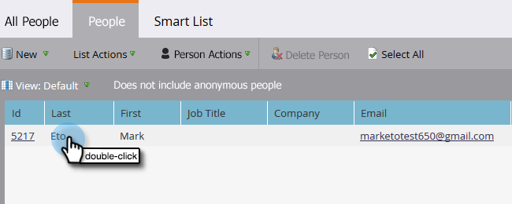

# Encaminhar para um Amigo por e-mail {#forward-to-a-friend-link-in-emails}

Adicionar o link &#39;Encaminhar para o amigo&#39; aos seus emails permite rastrear pessoas que receberam um email encaminhado por meio desse link e automaticamente as adiciona como uma nova pessoa se ainda não estiverem no banco de dados.

Por exemplo, digamos que Keith use o link &#39;Encaminhar para o Amigo&#39; para encaminhar o email a uma pessoa desconhecida, Mark. Mark é automaticamente adicionado como uma nova pessoa, recebe seu próprio cookie atribuído e qualquer atividade de email e da Web é vinculada a ele. No entanto, se Keith usa o botão de avanço em seu cliente de e-mail, Mark é incorretamente cozido como Keith, e sua atividade é registrada como Keith.

## Adicionar o link a um modelo de email {#add-the-link-to-an-email-template}

1. Vá para o **Design Studio**.

   

1. Localize e selecione o template de email ao qual deseja adicionar o link. Clique em **Editar rascunho**.

   

1. Cole o seguinte código de HTML onde deseja que o link &#39;Encaminhar para Amigo&#39; apareça (se precisar de ajuda com esta parte, entre em contato com seu desenvolvedor da Web):

   `<a href="{{system.forwardToFriendLink}}">Forward to Friend</a>`

   

   >[!TIP]
   >
   >
   >É possível adicionar estilo ao link para deixá-lo mais bonito. Por exemplo:
   >
   >`<a href="{{system.forwardToFriendLink}}" style="font-family:arial, sans-serif; padding:10px; position:absolute; right:0px;">Forward to Friend</a>`

   >[!CAUTION]
   >
   >Não é recomendável usar o estilo **position:relative** no modelo de email. Ele pode criar problemas com a posição e a exibição da caixa &#39;Encaminhar para um amigo&#39;.

1. Clique em **Visualizar rascunho** para verificar se a aparência do modelo é a desejada.

   

   >[!NOTE]
   >
   >Lembre-se de aprovar o rascunho do modelo para aplicar as alterações.

   Agora, todos os emails que usam esse modelo terão o link &#39;Encaminhar para um amigo&#39;. Quando o recipient do email clicar nele, ele será direcionado para uma versão da Web do email com a caixa &#39;Encaminhar para um amigo&#39;:

   

## Adicionar o link a um email individual {#add-the-link-to-an-individual-email}

Você também pode adicionar o link &quot;Encaminhar para o amigo&quot; diretamente em um email.

1. Abra o email que deseja incluir no link e clique duas vezes na área editável.

   

1. Coloque o cursor onde deseja que o link apareça e clique no botão **Inserir token**.

   

1. Selecione o token **`{{system.forwardToFriendLink}}`**.

   

   >[!NOTE]
   >
   >Esse token é o URL da versão da Web do email com uma caixa &quot;Encaminhar para o amigo&quot;.

1. Escreva o texto a ser exibido no link (por exemplo, &quot;Encaminhar para um amigo&quot;).

   

1. Recorte o token **`{{system.forwardToFriendLink}}`** usando Ctrl+X (Windows) ou Cmd+X (Mac). Realce &quot;Encaminhar para um amigo&quot; e clique no botão **Inserir/Editar link**.

   

1. Cole o token **`{{system.forwardToFriendLink}}`** na caixa **URL** usando Ctrl/Cmd+V e clique em **Inserir**.

   

1. Salve a edição e visualize seu novo link!

   

   >[!NOTE]
   >
   >As novas pessoas que são adicionadas ao receber um email &quot;Encaminhar para um amigo&quot; têm a assinatura cancelada de emails de marketing.

## Exibir atividade de encaminhamento {#view-forwarding-activity}

Você pode ver quem encaminhou e recebeu os emails no Registro de atividades da pessoa.

1. Vá para o **`Database`**.

   

1. Clique duas vezes na pessoa cuja atividade você deseja exibir.

   

1. Vá para a guia **Log de atividades**. Clique duas vezes em **Email de Encaminhamento para Amigo** ou **Email de Encaminhamento para Amigo** para ver detalhes.

   

   >[!NOTE]
   >
   >**Definição**
   >
   >Em E-mail de encaminhamento para amigo recebido, a ID de pessoa é a pessoa que encaminhou o e-mail.
   >
   >Para Email enviado para encaminhamento como amigo, a ID de pessoa é a pessoa que recebeu o email.

   

1. Para exibir uma pessoa por ID, copie e cole a **ID de pessoa** no final da URL (o início da URL dependerá da instância do Marketo):

   `...marketo.com/Database/loadPersonDetail?personId=`

   >[!NOTE]
   >
   >Tornaremos a **ID de pessoa** clicável e a vincularemos diretamente à pessoa em um patch futuro.

   

   >[!NOTE]
   >
   >Se o amigo que recebe o encaminhamento for uma pessoa desconhecida, uma nova pessoa será criada com &quot;Encaminhar para o amigo&quot; marcado como o **Source** da pessoa.
   >Se o email for um ativo local de um programa, ele será marcado como o **Programa de aquisição** da pessoa.

## Acionar ou filtrar usando atividade de encaminhamento {#trigger-or-filter-using-forwarding-activity}

Há seis acionadores/filtros que você pode usar para acionar ações de fluxo ou filtrar pessoas por atividades &quot;Encaminhar para um amigo&quot; enviadas e recebidas.

Em uma lista inteligente de campanha inteligente, se pesquisar por &quot;encaminhar&quot;, você encontrará os acionadores e filtros disponíveis.

## Testar Encaminhar para Amigo {#test-forward-to-friend}

Para testar &quot;Encaminhar para o amigo&quot;, envie um email com o link de encaminhamento. Certifique-se de enviá-lo por meio da etapa de fluxo **Enviar Email**, *não* por meio de **Enviar Email de Teste**.
