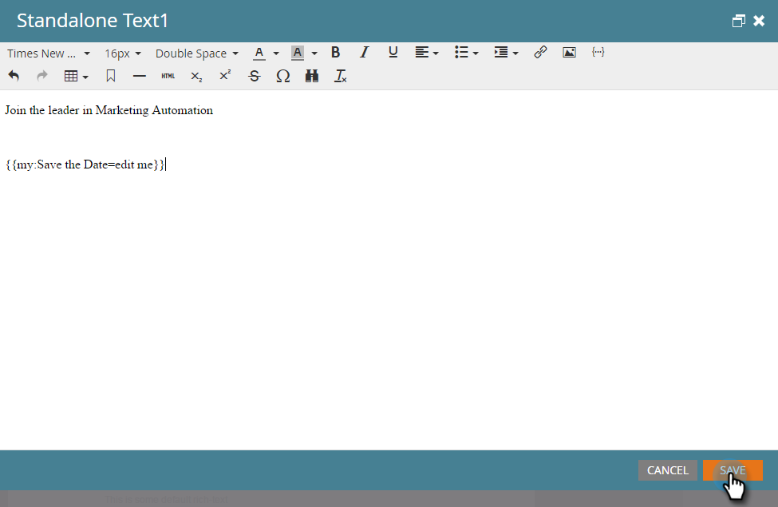

# Incluir um evento de calendário (.ics) em um email {#include-a-calendar-event-ics-in-an-email}

Um token de Arquivo de calendário permite adicionar um link de evento de calendário (.ics) aos emails do Marketo.

>[!PREREQUISITES]
>
>[Criar um Arquivo de Evento de Calendário (.ics)](/help/marketo/product-docs/email-marketing/general/functions-in-the-editor/create-a-calendar-event-ics-file.md)

1. Ao editar o email do seu programa, clique onde deseja colocar o token e clique no botão **Inserir Token**.

1. Selecione o token do Arquivo de Calendário e clique em **[!UICONTROL Inserir]**.

   

1. Clique em **[!UICONTROL Salvar]**.

   

   Seus destinatários receberão um email com esta aparência.

   

Missão cumprida!
