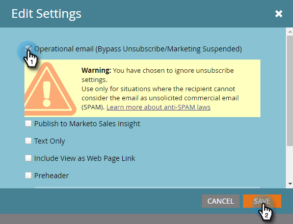

# Tornar um email operacional {#make-an-email-operational}

Emails operacionais ignoram os status Cancelamento de assinatura e Marketing Suspenso. Também não estão sujeitos a limites de comunicação. Eles enviam não importa o que aconteça.

>[!NOTE]
>
>Emails operacionais não contam para limites de comunicação. Por exemplo, se alguém puder receber apenas um email por semana e você já tiver enviado um email de marketing para ele, ainda será possível enviar um email operacional, se necessário.

1. Encontre seu email, selecione-o e clique em **Editar Rascunho**.

>[!NOTE]
>
>Você só deve usar Emails operacionais para emails críticos e respondedores automáticos. Eles não se destinam a emails de marketing.

1. Assim que o editor for aberto, clique em **Configurações de email**.

   

1. Verifique o **Email Operacional** e clique em **Salvar**.

   

>[!CAUTION]
>
>Emails operacionais não foram projetados para funcionar com programas de envolvimento. Assim, um programa de engajamento ignorará o status operacional de um email. Lembre-se disso ao trabalhar com eles.

Não se esqueça de aprovar este email para que as alterações entrem em vigor. Saiba como [aprovar um email](/help/marketo/product-docs/email-marketing/general/creating-an-email/approve-an-email.md).
