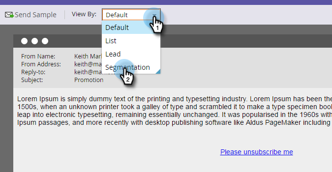
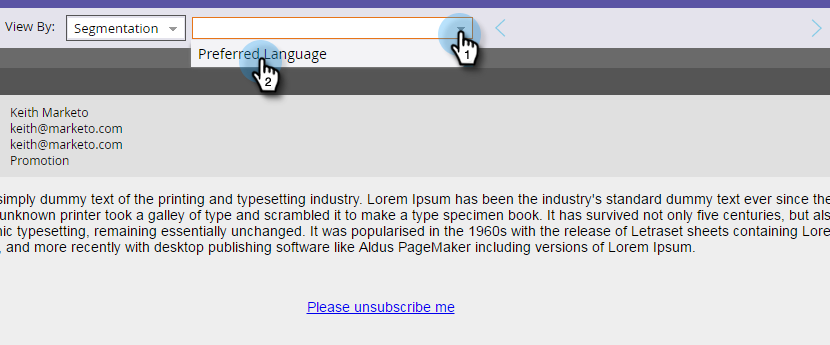

# Pré-visualizar um email com conteúdo dinâmico {#preview-an-email-with-dynamic-content}

Pré-visualize o email depois de adicionar conteúdo dinâmico para verificá-lo.

1. Selecione seu email e clique em **[!UICONTROL Visualizar Email]**.

   

1. Clique no menu suspenso **[!UICONTROL Exibir por]** e selecione o tipo de conteúdo dinâmico que deseja visualizar.

   

1. Uma nova lista suspensa é exibida. Clique nele e escolha o conteúdo específico.

   

1. Use as setas para percorrer as opções.

   

Você também pode visualizar o conteúdo dinâmico diretamente no editor de email.

1. Em **[!UICONTROL Conteúdo]**, clique na guia **[!UICONTROL Dinâmico]**.

   

1. Clique no conteúdo que deseja visualizar.

   

Ótimo! Pré-visualize seus emails para garantir que o conteúdo seja da maneira que você deseja.
