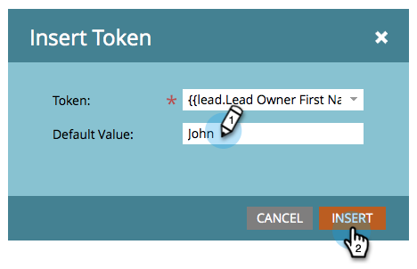
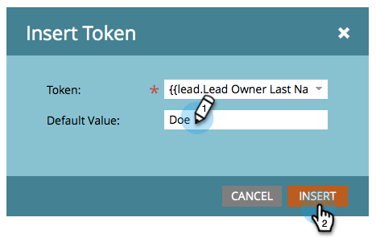

# Enviar emails do proprietário do cliente potencial {#send-emails-from-the-lead-owner}

E se você quiser enviar um email para um cliente potencial em nome do Proprietário principal?  Veja como.

1. Localize seu email, selecione-o e clique em **Editar rascunho**.

   

1. Clique no campo **De** (exclua qualquer nome existente) e clique no botão **Inserir token** .

   

1. Start digitando &quot;`{{lead.Lead Owner`&quot; e selecione o **`{{lead.Lead Owner First Name}}`** token.

   

1. Insira um valor padrão caso o cliente potencial ainda não tenha um proprietário de cliente potencial e clique em **Inserir**.

   

1. Clique depois do primeiro token, adicione um espaço e clique no botão **Inserir token** .

   

1. Start digitando &quot;`{{lead.Lead Owner`&quot; e selecione o **`{{lead.Lead Owner Last Name}}`** token.

   

1. Insira um valor padrão caso o cliente potencial ainda não tenha um proprietário de cliente potencial e clique em **Inserir**.

   

   >[!TIP]
   >
   >Verifique se você adicionou um espaço entre os tokens de nome e sobrenome.

   Clique no campo De email (exclua qualquer endereço de email existente) e clique no botão Inserir token.
   

1. Start digitando &quot;`{{lead.Lead Owner`&quot; e selecione o **`{{lead.Lead Owner Email Address}}`** token.

   

1. Insira um valor padrão caso o cliente potencial ainda não tenha um proprietário de cliente potencial e clique em **Inserir**.

   

1. Verifique se os campos **Responder** e **Assunto** estão preenchidos e se você está pronto!

   

