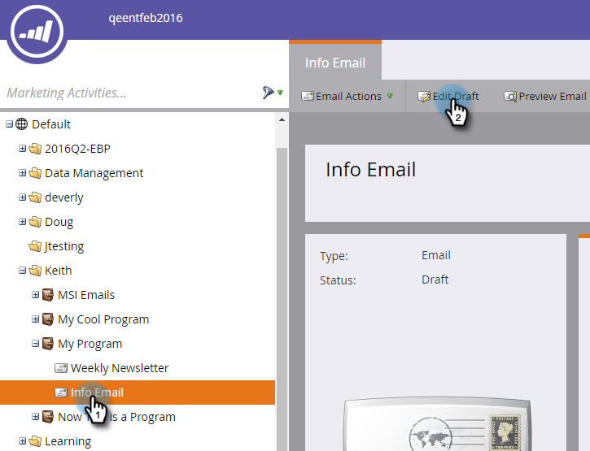
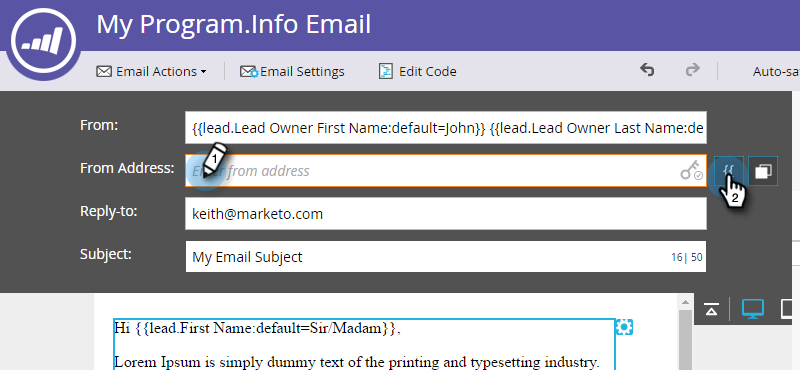
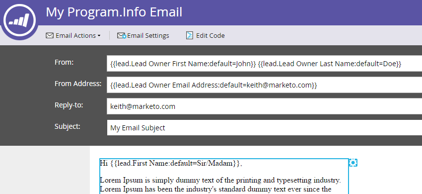

# Enviar emails do proprietário de leads {#send-emails-from-the-lead-owner}

E se você quiser enviar um email para um cliente potencial em nome do Proprietário do cliente potencial?  Veja como.

1. Encontre seu email, selecione-o e clique em **[!UICONTROL Editar Rascunho]**.

   

1. Clique no campo **[!UICONTROL De]** (exclua qualquer nome existente) e clique no botão **Inserir token**.

   

1. Comece a digitar &quot;`{{lead.Lead Owner`&quot; e selecione o token **`{{lead.Lead Owner First Name}}`**.

   

1. Insira um valor padrão caso o cliente potencial ainda não tenha um proprietário de cliente potencial e clique em **[!UICONTROL Inserir]**.

   

1. Clique depois do primeiro token, adicione um espaço e clique no botão **Inserir token**.

   

1. Comece a digitar &quot;`{{lead.Lead Owner`&quot; e selecione o token **`{{lead.Lead Owner Last Name}}`**.

   

1. Insira um valor padrão caso o cliente potencial ainda não tenha um proprietário de cliente potencial e clique em **[!UICONTROL Inserir]**.

   

   >[!TIP]
   >
   >Verifique se você adicionou um espaço entre os tokens de nome e sobrenome.

1. Clique no campo **[!UICONTROL Do endereço]** (exclua qualquer endereço de email existente) e clique no botão **Inserir token**.

   

1. Comece a digitar &quot;`{{lead.Lead Owner`&quot; e selecione o token **`{{lead.Lead Owner Email Address}}`**.

   

1. Insira um valor padrão caso o cliente potencial ainda não tenha um proprietário de cliente potencial e clique em **[!UICONTROL Inserir]**.

   

1. Verifique se os campos **[!UICONTROL Responder para]** e **[!UICONTROL Assunto]** estão preenchidos, e pronto!

   
