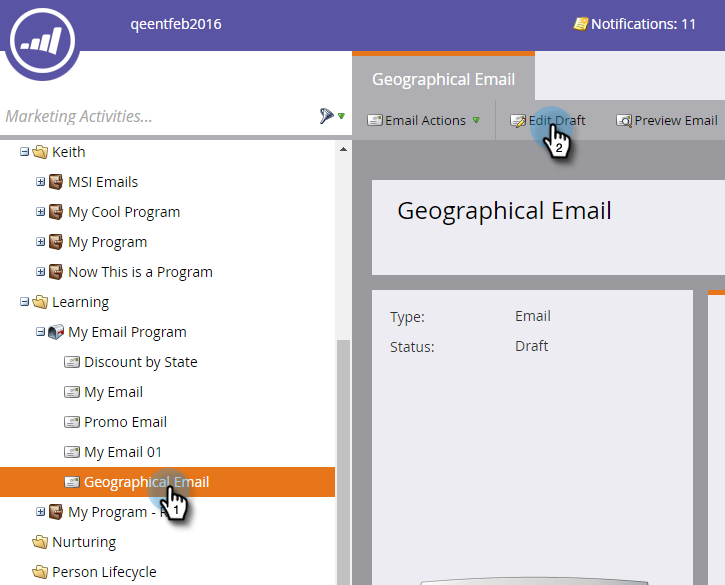

# Uso de conteúdo dinâmico em um email {#using-dynamic-content-in-an-email}

>[!PREREQUISITES]
>
>[Criar uma segmentação](/help/marketo/product-docs/personalization/segmentation-and-snippets/segmentation/create-a-segmentation.md)

Use o Conteúdo dinâmico em emails para enviar informações direcionadas aos seus clientes potenciais.

>[!NOTE]
>
>O uso de variáveis no conteúdo dinâmico em um email só é compatível com o uso de Campanhas de acionador. **Não** suportado ao usar Campanhas em Lote.

## Adicionar segmentação {#add-segmentation}

1. Vá para **Atividades de marketing**.

   

1. Selecione seu email e clique em **Editar Rascunho**.

   

1. Neste exemplo, estamos tornando a Linha de assunto dinâmica. Clique no campo Assunto e no botão **Tornar dinâmico**.

   

   >[!NOTE]
   >
   >Você também pode tornar um elemento dentro do email dinâmico. Para fazer isso, selecione a área, clique no ícone de engrenagem e selecione **Tornar dinâmico** (ou [Substituir por trecho](/help/marketo/product-docs/personalization/segmentation-and-snippets/snippets/create-a-snippet.md), dependendo do que você estiver fazendo).

1. Insira o nome da Segmentação, selecione-o e clique em **Salvar**.

   

   Sua segmentação e seus segmentos aparecem na guia Dinâmico à direita.

   

## Aplicar conteúdo dinâmico {#apply-dynamic-content}

>[!CAUTION]
>
>O número de elementos de conteúdo dinâmico permitidos não é ilimitado. Embora não haja um limite de número específico (pode variar com base na combinação de conteúdo), o uso excessivo de conteúdo dinâmico pode afetar negativamente o desempenho do email. Recomendamos manter a quantidade de elementos de conteúdo dinâmico usados para menos de 20 por email.

1. Clique nos segmentos e adicione a linha de assunto.

1. Repita o procedimento para cada segmento.

   

>[!TIP]
>
>Crie um email padrão antes de aplicar conteúdo aos vários segmentos.

>[!CAUTION]
>
>As alterações no bloco de conteúdo Segmento padrão são aplicadas a todos os segmentos.

Doce! Agora você pode enviar emails flexíveis para seu público-alvo.

>[!MORELIKETHIS]
>
>* [Visualizar um Email com Conteúdo Dinâmico](/help/marketo/product-docs/email-marketing/general/functions-in-the-editor/preview-an-email-with-dynamic-content.md)
>* [Usar Conteúdo Dinâmico em uma Página de Aterrissagem](/help/marketo/product-docs/demand-generation/landing-pages/free-form-landing-pages/use-dynamic-content-in-a-free-form-landing-page.md)
